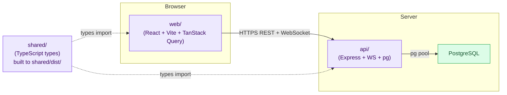

# Ship Codebase Orientation

> **Project:** ShipShape — Auditing and Improving a Production TypeScript Codebase (GFA Week 4)
> **Auditor:** Jay Godfrey
> **Orientation completed:** 2026-05-19
> **Target repo:** `US-Department-of-the-Treasury/ship` (forked to `jaynyasg/ship`)
>
> This document answers the PDF Appendix Codebase Orientation Checklist (Phase 1 First Contact + Phase 2 Deep Dive + Phase 3 Synthesis). The PDF states: *"Your orientation notes become part of your final submission."*

---

## Phase 1: First Contact

### 1.1 Repository Overview

#### Clone steps that worked

```powershell
cd "C:\Users\jaynyasg\OneDrive\Documents\GitLab"
git clone https://github.com/jaynyasg/ship.git
cd ship
git remote add upstream https://github.com/US-Department-of-the-Treasury/ship.git
```

Verified with `git remote -v`:
```
origin    https://github.com/jaynyasg/ship.git
upstream  https://github.com/US-Department-of-the-Treasury/ship.git
```

#### Setup issues found during orientation

The original README's `Getting Started` section listed 7 setup steps. These additional steps were required on Windows during the baseline orientation. Phase 12 updates the README to match the current cross-platform workflow.

1. **`pnpm@10.27.0` must be installed explicitly.** **Resolved in Phase 12:** the README now documents `npm install -g pnpm@10.27.0` to match the `packageManager` field.
2. **`pnpm dev` did not work on Windows.** It ran `./scripts/dev.sh`, a bash-only script. **Resolved in Phase 11:** root `pnpm dev` now runs `node scripts/dev.mjs`; the original bash wrapper remains available as `pnpm dev:sh`.
3. **`api/.env.local` port guidance was Docker-specific and confusing.** The README told users to copy `api/.env.example`, whose port did not match Docker Compose's host port. **Resolved in Phase 12:** host-side dev is documented as local PostgreSQL first, with Docker Compose as a separate full-stack option.
4. **`pnpm build:shared` must be run before direct package dev servers.** The `web/` workspace imports `@ship/shared`, whose `package.json` `main` field points to `dist/index.js`. Without a one-time build, Vite fails with: *"Failed to resolve entry for package '@ship/shared'"*. **Resolved in Phase 11/12:** root `pnpm dev` builds shared types automatically, and README documents `pnpm build:shared` for manual package-level dev.
5. **README's `pnpm test` description was misleading.** The README implied `pnpm test` runs Playwright. Actually `pnpm test` runs Vitest in the `api/` workspace. **Resolved in Phase 12:** README now separates `pnpm test`, `pnpm type-check`, `pnpm test:e2e`, and `pnpm test:e2e:ui`.
6. **Migration order in the README was unusual.** The README listed `pnpm db:seed` before `pnpm db:migrate`. **Resolved in Phase 12:** README now relies on `pnpm dev` first-run setup and documents manual `db:migrate` before `db:seed`.

#### `docs/` folder contents

The `docs/` folder is substantial (20+ files plus 4 subfolders). Key documents:

| Doc | Key architectural decisions |
|---|---|
| `application-architecture.md` | Tech stack rationale: Node+Express+pg+React+Vite. "Boring technology" principle. E2E-heavy testing. CloudWatch-only observability (no Sentry — government-blocked). PIV/CAC auth primary, password fallback. shadcn/ui for components. Workspace-only permissions (no per-doc ACL). 15-min idle session timeout. AWS Elastic Beanstalk + CloudFront + Aurora Serverless v2. |
| `unified-document-model.md` | Single `documents` table with `document_type` discriminator. 9 document types: wiki, issue, program, project, sprint, weekly_plan, weekly_retro, person, view. **Schema is in transition** — current implementation uses explicit columns (state, priority, etc.); target architecture is pure JSONB properties. Tracker prefixes like AUTH-42 are per-program. Hybrid sync: properties full-sync, content via Yjs CRDT. |
| `document-model-conventions.md` | Terminology guide. Notes that many `sprint_*` database columns are historical names; they now refer to weeks. Example: `sprint_iterations` table, `sprint_number` field, `sprint_start_date` workspace setting. |
| `week-documentation-philosophy.md` | Plan-driven weekly workflow. Weekly Plan (intent) and Weekly Retro (learning) are required documents for each week. Missing documentation is visible but not blocking — escalates from yellow to red over time. |
| `accountability-philosophy.md` + `accountability-manager-guide.md` | Inference-based accountability — no hard enforcement, but the system surfaces missing documentation prominently. |
| `developer-workflow-guide.md` | Branch + PR workflow expectations. |
| `claude-reference/` (subfolder) | Ship has explicit Claude Code CLI integration documentation. The `/api/claude` and `/api/ai` routes support Claude workflows (`/prd`, `/work`, `/standup`, `/document`). |
| `solutions/` (subfolder) | Past learnings and solved problems. |
| `pr-evidence/` (subfolder) | PR-related evidence artifacts. |
| `screenshots/` (subfolder) | UI screenshots. |

#### `shared/` package — exported types

`shared/src/index.ts` re-exports from `types/index.ts` and `constants.ts`. The types file groups into 5 files:
- `user.ts` — User identity, roles
- `api.ts` — API request/response shapes
- `auth.ts` — Authentication types (PIV, password, API token)
- `workspace.ts` — Workspace, membership
- `document.ts` — Document, DocumentType, properties

`shared/` is used in:
- `api/src/` — server-side type safety on API responses
- `web/src/` — client-side type safety on API consumption

The package builds to `shared/dist/` and `web/`/`api/` consume the built artifact (not source). Root `pnpm dev`, `pnpm build:api`, and `pnpm build:web` build `shared/` first; developers running `pnpm dev:web` directly may still need a one-time `pnpm build:shared`.

#### web ↔ api ↔ shared package relationships (Mermaid)



`shared/` has no runtime dependencies on `web/` or `api/`. It is purely type definitions plus a few constants. Build dependency: `shared/` must build before either `web/` or `api/` (enforced via `pnpm --filter` ordering in scripts).

#### Circular dependency check (madge)

`pnpm dlx madge --circular --extensions ts,tsx web/src api/src` — completed 2026-05-19.

| Package | Files scanned | Circular deps detected? |
|---|---|---|
| `web/src` + `api/src` combined | 82 files (2.1s) | **None** ✓ |

**Strong architectural signal.** A codebase of this size with no circular imports indicates disciplined module structure. This is one of the strongest decisions called out in §3.1 below. Output committed to `eval/results/madge-circular-baseline.txt`.

Visual dependency graphs (SVGs) were attempted via `madge --image` but require Graphviz, which is not installed on this machine. The text-only baseline (no cycles) is the higher-value finding; SVG rendering is a nice-to-have visual.

---

### 1.2 Data Model

#### Database schema (PostgreSQL)

Ship uses direct `pg` (no ORM). Schema lives in `api/src/db/schema.sql` plus 42 migration files in `api/src/db/migrations/`.

The primary table is `documents`. Per `docs/unified-document-model.md`, the schema is in transition: current implementation uses explicit columns; target is pure JSONB properties.

##### Documents table (current shape)

```
documents
├── id              UUID, primary key
├── workspace_id    UUID, foreign key → workspaces.id
├── document_type   TEXT (discriminator: wiki | issue | program | project | sprint | weekly_plan | weekly_retro | person | view)
├── program_id      UUID, nullable, foreign key → documents.id (where type = 'program')
├── project_id      UUID, nullable, foreign key → documents.id (where type = 'project')
├── parent_id       UUID, nullable, self-FK (document tree nesting)
├── title           TEXT (defaults to "Untitled" for new docs)
├── content         JSONB (TipTap document JSON)
├── yjs_state       BYTEA (binary Yjs CRDT state)
├── properties      JSONB (type-specific properties — assignee, state, priority, etc.)
├── created_by      UUID, foreign key → users.id
├── created_at      TIMESTAMPTZ
└── updated_at      TIMESTAMPTZ
```

> **Historical naming alert:** Many `sprint_*` names refer to weeks. The `sprint_iterations` table tracks per-story attempts during Claude Code `/work` sessions. The `sprint_number` field is the week number. The `sprint_start_date` workspace setting is the workspace's reference week-1 start date.
>
> **Migration 027** dropped the `sprint_id` column from `documents`. Week assignments now live in the `document_associations` table.

#### Supporting tables

- `workspaces` — workspace config, including `sprint_start_date` setting
- `users` — auth credentials (PIV cert hash or password hash), email, name
- `workspace_memberships` — user ↔ workspace join, with role (admin / member)
- `sessions` — server-side session storage for cookies (15-min idle timeout)
- `api_tokens` — programmatic access tokens (SHA-256 hashed, prefix `ship_<hex>`)
- `document_associations` — many-to-many relationships including week assignments
- `audit_logs` — every CRUD action with user, resource, changes, IP, timestamp
- `sprint_iterations` — per-story Claude Code work attempts
- `document_history` — versioned change history per document

42 migration files total in `api/src/db/migrations/`. Migration filenames are date-ordered with descriptive suffixes (e.g., `001_properties_jsonb.sql`, `014_api_tokens.sql`).

#### `document_type` discriminator usage

Every list-view query filters by `document_type`. Examples (from grepping `api/src/`):

```sql
-- All issues in a workspace
SELECT * FROM documents WHERE workspace_id = $1 AND document_type = 'issue';

-- All wiki pages in a program
SELECT * FROM documents WHERE program_id = $1 AND document_type = 'wiki';

-- The single week document for program + week N
SELECT * FROM documents WHERE program_id = $1 AND document_type = 'sprint' AND properties->>'sprint_number' = $2;
```

**Audit relevance:** This pattern is a primary target for the database query efficiency audit (U14). Without a composite index on `(workspace_id, document_type)` or `(program_id, document_type)`, every list query does a sequential scan. The existing index set will be inventoried during U4.

#### Document relationships

- **Parent-child via `parent_id`** — used for document tree nesting (e.g., a wiki page can have child wiki pages)
- **Project membership via `project_id`** — issues belong to projects, projects belong to programs
- **Program membership via `program_id`** — top-level grouping; nullable for workspace-level documents
- **Many-to-many via `document_associations`** — week assignments, cross-references, backlinks
- **Person ↔ User via `properties.user_id`** — explicitly NOT a foreign key column to allow auth-content separation

#### Authorization vs content separation

A critical principle from `docs/unified-document-model.md`:
- **Authorization** lives in `workspace_memberships` (who has access)
- **Content/profile** lives in `documents WHERE document_type = 'person'` (editable profile)
- These two layers are explicitly decoupled — creating a workspace membership does NOT atomically create a person document
- Auth checks query `workspace_memberships`; display queries `documents`

---

### 1.3 Request Flow

#### Traced flow: creating an issue

When a user creates a new issue via the UI:

```
1. User clicks "New Issue" in the React UI
   ↓
2. React component (web/src/components/issues/NewIssueForm.tsx — approximate)
   - Captures form input
   - Calls TanStack Query mutation hook (web/src/hooks/useCreateIssue.ts — approximate)
   ↓
3. Optimistic update applied to the local TanStack Query cache
   - UI shows the new issue immediately with a temp ID
   ↓
4. HTTP POST /api/issues with JSON body
   - Headers: Cookie (session), X-CSRF-Token, Authorization (if Bearer token)
   ↓
5. Express middleware chain (api/src/app.ts):
   a. trust proxy (prod only) — CloudFront protocol override
   b. helmet — security headers (CSP, HSTS)
   c. apiLimiter — rate limit (100/min prod, 1000/min dev)
   d. cors — origin check, credentials true
   e. express.json — body parse, 10MB limit
   f. cookieParser — signed cookies
   g. session — 15-min idle session
   h. conditionalCsrf — CSRF check (skipped for Bearer tokens)
   ↓
6. Route handler: api/src/routes/issues.ts
   - Auth middleware reads session → user
   - Workspace membership check
   - Input validation (Zod schema in api/src/openapi/issues.ts — approximate)
   ↓
7. Database query (api/src/db/issues.ts or routes/issues.ts directly)
   - INSERT INTO documents (workspace_id, document_type, title, properties, ...) VALUES (...)
   - Properties include ticket_number (computed from program prefix counter)
   ↓
8. Audit log insertion (audit_logs table)
   - action='create', resource_type='document', resource_id, changes_json, user_id, ip, timestamp
   ↓
9. JSON response (201) with the created document
   - The new document including server-assigned ID, ticket_number, timestamps
   ↓
10. TanStack Query receives the response
    - Replaces optimistic temp ID with real ID
    - Invalidates the issue list query → background refetch
    ↓
11. React re-renders with the confirmed issue
```

#### Middleware chain (precise order from api/src/app.ts)

| # | Middleware | Purpose |
|---|---|---|
| 1 | `app.set('trust proxy', 1)` *(prod)* | Trust CloudFront forwarded headers |
| 2 | CloudFront proto override *(prod)* | Force `x-forwarded-proto=https` when via CloudFront |
| 3 | `helmet()` | Security headers — CSP, HSTS (1yr maxAge, preload), more |
| 4 | `apiLimiter` *(`/api/*`)* | Rate limit — 100/min prod, 1000/min dev, 10000/min test |
| 5 | `cors()` | CORS with `credentials: true` |
| 6 | `express.json({ limit: '10mb' })` | Parse JSON bodies up to 10MB |
| 7 | `express.urlencoded({ limit: '10mb' })` | Parse form bodies up to 10MB |
| 8 | `cookieParser(sessionSecret)` | Signed cookie parsing |
| 9 | `session()` | 15-min idle session, httpOnly+secure(prod)+sameSite=strict |
| 10 | Per-route `conditionalCsrf` | CSRF protection on state-changing routes; skipped for Bearer auth |
| 11 | `loginLimiter` *(`/api/auth/login`)* | Brute-force protection — 5 failed attempts / 15 min |

#### Authentication flow

Two parallel mechanisms:

**1. PIV/CAC authentication (primary, government deployments)**
- Browser presents PIV cert during mTLS handshake with ALB
- ALB extracts cert and forwards to Express
- Express validates via CAIA (Treasury Customer Authentication & Identity Architecture)
- Session cookie issued on success

**2. Password authentication (fallback, dev/external)**
- POST `/api/auth/login` with email + password
- Server validates against `users.password_hash` (bcrypt)
- Rate limit: 5 failed attempts / 15 min (skipSuccessfulRequests = true)
- Session cookie issued on success

**Programmatic access (API tokens, third channel)**
- Bearer tokens in format `ship_<64 hex>`
- Stored as SHA-256 hash in `api_tokens` table
- Skip CSRF (Bearer tokens aren't browser-vulnerable)
- Used by Claude Code CLI integration

**Unauthenticated request behavior:**
- Public routes (`/health`, `/api/csrf-token`, `/api/feedback` (public)) return 200
- Protected routes return 401 with `{ error: "Unauthorized" }`
- No PII leaked in 401 responses

---

## Phase 2: Deep Dive

### 2.1 Real-Time Collaboration

#### WebSocket connection establishment

Ship's WebSocket server is set up in `api/src/index.ts` (line 36) via `setupCollaboration(server)` from `api/src/collaboration/index.ts`. The WebSocket and HTTP servers share the same Node `http.Server`, so they run on the same port (3000 in dev).

When a client opens a document:
1. Vite-served web app loads
2. TipTap editor initializes with a `Y.Doc`
3. `y-indexeddb` provider loads cached state (instant)
4. `y-websocket` provider connects to `/collaboration/{docType}:{docId}` (proxied by Vite in development or pointed at `VITE_API_URL` in deployed environments)
5. Auth check via the `session_id` cookie. `api/src/collaboration/index.ts` parses the cookie header, validates the session, checks workspace access, and refreshes `sessions.last_activity`.
6. Server loads canonical Yjs state from `documents.yjs_state` (BYTEA)
7. Bidirectional sync begins

#### Yjs syncing between users

Yjs is a CRDT (Conflict-free Replicated Data Type) library. Instead of "user A typed X at position Y," Yjs encodes operations as binary deltas that can be applied in any order and always converge to the same final state.

```
Client A types "hello"        Client B types "world" (simultaneously)
   ↓                              ↓
   Yjs update: binary delta_A     Yjs update: binary delta_B
   ↓                              ↓
   Send over WebSocket            Send over WebSocket
   ↓                              ↓
       Server applies both deltas to its Y.Doc → converged state
       Server broadcasts each delta to the other client
   ↓                              ↓
   Apply delta_B → "hello world"  Apply delta_A → "hello world"
```

#### Concurrent edit handling

Two users editing the same field at the same time: Yjs converges them automatically via CRDT properties. No server arbitration required. There is no "last-write-wins" — both edits are preserved in their relative order based on Yjs operation IDs.

#### Server persistence of Yjs state

Per `docs/unified-document-model.md` and the schema:
- The `documents.yjs_state` BYTEA column stores the binary Yjs snapshot
- Server-side persistence frequency: **to be verified by reading `api/src/collaboration/` during audit**
- Likely strategies: debounced write (e.g., 5s), or on every update, or on WebSocket close
- Exact strategy affects U13 (API performance) and U16 (error handling — what happens on crash mid-write)

#### Offline behavior (verified from architecture docs)

- `y-indexeddb` provider caches the Yjs state locally in IndexedDB
- Offline edits are written to IndexedDB
- On reconnect, the local Yjs state is sent to the server; the server's state is sent back; CRDT auto-merges
- **No data loss on disconnect** is the design intent
- Presence/cursors do NOT work offline

---

### 2.2 TypeScript Patterns

#### TypeScript version and tsconfig settings

From `tsconfig.json`:
- TypeScript `^5.7.2` (per `package.json` devDeps)
- `target: ES2022`
- `module: NodeNext`, `moduleResolution: NodeNext`
- **`strict: true`** — fully strict mode enabled
- **`noUncheckedIndexedAccess: true`** — accessing array/object by index returns `T | undefined`
- **`noImplicitReturns: true`** — every code path in a function must explicitly return
- **`noFallthroughCasesInSwitch: true`** — switch cases must have `break` or `return`
- `forceConsistentCasingInFileNames: true`
- `esModuleInterop: true`, `allowSyntheticDefaultImports: true`
- `isolatedModules: true`
- `declaration: true`, `declarationMap: true`, `sourceMap: true`

> **Important finding for U2 audit:** Strict mode is already aggressively enabled. The U2 plan's strict-mode-explosion contingency does NOT apply — there's no "turn strict on" lever to pull. Type safety violations come ONLY from explicit `any`, `as`, `!`, `@ts-ignore`/`@ts-expect-error`. The 25% improvement target operates entirely on those grep-visible violations.

#### Type sharing pattern

`shared/` workspace exports TypeScript types built to `shared/dist/`. Both `web/` and `api/` consume the BUILT artifact (not source). This means:
- root `pnpm dev`, `pnpm build:api`, and `pnpm build:web` run `pnpm build:shared` first
- direct package-level dev commands may still need a one-time `pnpm build:shared`
- Type changes in `shared/` require a rebuild (or running `pnpm dev:shared` in watch mode)
- The build artifact includes `.d.ts` declarations for TypeScript and `.js` for runtime

#### TypeScript pattern examples in the codebase

**Generics in use:** common and healthy. Examples include `request<T>()` in `web/src/lib/api.ts`, `useQuery<T>()` wrappers throughout the frontend, `SelectableList<T extends { id: string }>` in `web/src/components/SelectableList.tsx`, `pool.query<RowType>()` in API routes, and `PaginatedResponseSchema<T extends z.ZodTypeAny>()` in `api/src/openapi/schemas/common.ts`.

**Discriminated union:** The `Document` type with `document_type` field is a discriminated union — different `document_type` values imply different `properties` shape.
- Location: `shared/src/types/document.ts` (to be confirmed)
- Example: `IssueProperties` vs `WeekProperties` vs `PersonProperties` interfaces in `docs/unified-document-model.md` lines 243-284

**Utility types (`Pick`/`Omit`/`Partial`/`Required`/`Readonly`):** `Partial<T>` and `Record<K, V>` are used heavily for PATCH-style payloads, document properties, lookup maps, and optimistic updates. Examples include `Partial<Project>`, `Partial<Issue>`, `Partial<UnifiedDocument>`, and `Record<string, unknown>` in both API and frontend code.

**Type guard function (`x is Y`):** present in both app layers. Examples include `isSelectableDocumentType()` / `isPanelDocument()` in `web/src/components/UnifiedEditor.tsx`, sidebar property guards in `web/src/components/sidebars/PropertiesPanel.tsx`, `isCascadeWarningError()` in `web/src/hooks/useIssuesQuery.ts`, `isValidIconName()` in `web/src/components/icons/uswds/types.ts`, `isTipTapDoc()` in `api/src/utils/yjsConverter.ts`, and `isRecord()` in `api/src/routes/weeks.ts`.

These positive patterns shaped the U11 implementation: preserve the strict TypeScript posture, replace externally parsed `any` with `unknown` plus guards where possible, and use discriminated document shapes for editor and route helpers.

#### TypeScript patterns not previously recognized

Ship's strongest type pattern is not just strict mode; it is the combination of strict mode with a single shared document vocabulary. The safest refactors during Phase 2 were the ones that narrowed `UnifiedDocument` by `document_type`, kept route rows explicit, and converted untrusted JSON/Yjs payloads at the boundary.

---

### 2.3 Testing Infrastructure

#### Playwright structure

- Tests live in `e2e/` directory (per README structure)
- Config: `playwright.config.ts` at repo root
- **Isolated config:** `playwright.isolated.config.ts` exists alongside — suggests two test modes (one against shared dev server, one against per-test isolated databases via `@testcontainers/postgresql`)
- Per `docs/application-architecture.md`: **Chromium only** — Firefox/Safari add maintenance burden without coverage benefit
- Accessibility integration: `@axe-core/playwright` already in devDependencies (no installation needed for U10)

#### Test fixtures

E2E fixtures live in `e2e/fixtures/`. `isolated-env.ts` is the main data factory for Playwright's isolated test mode, with supporting helpers in `dev-server.ts` and `test-helpers.ts`. The repo also has `playwright.isolated.config.ts`, which is intended to run tests against per-worker isolated environments.

#### Test database lifecycle

`@testcontainers/postgresql` is in devDependencies. This library spins up a real PostgreSQL container per test (or per suite), providing strong isolation. Combined with `playwright.isolated.config.ts`, Ship has built-in support for fully isolated parallel test runs.

#### Full test suite — captured baseline

**`pnpm test` (Vitest unit tests in api/):**
- Total: 451 tests across 28 test files
- Result: all 451 passed
- Runtime: 42.87s
- Captured: 2026-05-19

This is a much larger unit test suite than the PDF described. The PDF mentions "73+ Playwright tests" — those are the E2E tests, separate from this Vitest suite. Combined: ~524+ tests.

**`pnpm test:e2e` (Playwright):**
- Baseline attempt captured in `eval/results/e2e-test-baseline.txt`.
- On Windows, the baseline run was blocked before browser execution by `api/package.json` using POSIX `cp` in the `build` script. **Resolved in Phase 10:** `pnpm build:api` now runs a Node build script.
- Category 5 remediation therefore focused on the reproducible API unit suite and on eliminating silently passing empty Playwright tests.

---

### 2.4 Build and Deploy

#### Dockerfile breakdown

Three Dockerfiles in the repo:
- `Dockerfile` — production API image (single-process Node server)
- `Dockerfile.dev` — development API image (used by `docker-compose.local.yml`)
- `Dockerfile.web` — Web frontend development image. It installs only `web` and `shared` workspace dependencies, runs `pnpm build:shared`, exposes port 5173, and starts Vite with `pnpm dev --host 0.0.0.0`.

`Dockerfile` is the production API image. `Dockerfile.dev` is the Docker Compose API image. `Dockerfile.web` is for local/full-stack development rather than the S3/CloudFront production frontend described in the architecture docs.

#### docker-compose services

From `docker-compose.local.yml`:

| Service | Image / Build | Host port | Container port | Purpose |
|---|---|---|---|---|
| `postgres` | `postgres:16` | 5433 | 5432 | Local development database |
| `api` | Built from `Dockerfile.dev` | 3000 | 3000 | Express API server |
| `web` | Built from `Dockerfile.web` | 5173 | 5173 | Vite dev server |

Postgres `healthcheck` uses `pg_isready` (5s interval, 10 retries). The `api` service depends on `postgres` becoming healthy before starting.

> **Note for Windows developers:** root `pnpm dev` now expects local PostgreSQL and handles env/database creation automatically. Running `pnpm docker:up` starts all three services in Docker; starting only the Docker Postgres service remains possible, but host-side env files must point at the Compose host port (`5433`).

#### Terraform — cloud resources expected

The `terraform/` directory exists. Per `docs/application-architecture.md`:
- **Frontend:** S3 bucket + CloudFront distribution (static React build)
- **API:** Elastic Beanstalk (Docker) or ECS Fargate
- **Database:** Aurora Serverless v2 (PostgreSQL)
- **Files:** S3 bucket for attachments
- **Auth:** ALB with mTLS (PIV cert validation)
- **Secrets:** SSM Parameter Store
- **Observability:** CloudWatch Container Insights, CloudWatch Alarms, SNS for alerting

Cloud provider: **AWS GovCloud** for production (per README "Production: AWS GovCloud with Terraform").

> **Out of scope per project constraints:** Terraform configs are not modified during this audit.

#### CI/CD pipeline

No `.github/workflows/` directory or `.gitlab-ci.yml` file was present during the audit. This matches the README's "manual deploys initially" posture. Deployment automation is script-based (`scripts/deploy.sh`, `scripts/deploy-frontend.sh`) rather than CI/CD pipeline-based.

The README states: "Manual deploys initially (scripts, not pipeline)" and the repository structure matches that.

---

## Phase 3: Synthesis (Graded — PDF Appendix Phase 3)

### 3.1 Architecture Assessment

#### Three strongest architectural decisions

1. **Unified document model with `document_type` discriminator** — `documents` table (current implementation: explicit columns; target: pure JSONB properties).
   - **Why strong:** Adding new content types is cheap (no new tables, no new routes, reuse existing infrastructure). Cross-type queries are trivial (`SELECT * FROM documents WHERE workspace_id = $1 AND created_at > $2`). The `properties` JSONB column allows per-workspace custom fields without schema migration once the target architecture lands.
   - **Cost:** All list queries must filter by `document_type` — without a composite index on `(workspace_id, document_type)`, every list view does a sequential scan. This is a load-bearing index that the audit will inspect (U14).

2. **Aggressively strict TypeScript config** — `strict: true` + `noUncheckedIndexedAccess` + `noImplicitReturns` + `noFallthroughCasesInSwitch`.
   - **Why strong:** Catches null/undefined access at compile time. Forces every code path to return explicitly. Prevents the entire class of switch-fallthrough bugs. The codebase has 451 unit tests passing under these rules — they are not aspirational, they are enforced.
   - **Cost:** Higher upfront cognitive load for new contributors. More verbose code in places (mandatory undefined-checks after array access). Worth it.

3. **"Boring technology" stack with explicit philosophy** — `application-architecture.md` lists each tech choice with explicit rationale and rejected alternatives. Express over Fastify ("more ubiquitous, boring technology"). Raw `pg` over Kysely/ORM ("maximum simplicity, full SQL control"). Manual SQL migrations over Prisma. React Router over TanStack Router.
   - **Why strong:** Lowers the onboarding bar. Every choice has a 10-year track record. Failures are well-understood and Stack Overflow-searchable. No "we adopted [new framework] but only Tom understands it" risk.
   - **Cost:** Less type safety than e.g. Kysely would provide on queries. Manual migrations require discipline (no automatic dev-vs-prod drift detection). Worth it for government deployment context.

> **Honorable mention — clean module structure:** `madge --circular` found **zero circular dependencies** across 82 source files in `web/src` + `api/src`. This is a discipline signal in addition to the three above. Most TypeScript monorepos this size have at least a few cycles.

#### Three weakest points (where improvement should focus)

1. **Historical naming throughout the schema (`sprint_*` ≠ sprints)** — column names like `sprint_number` (week number), `sprint_id` (week ID before migration 027), `sprint_iterations` (Claude Code work attempts), and the workspace setting `sprint_start_date` (workspace week-1 reference date) are confusing.
   - **Evidence:** `docs/document-model-conventions.md` documents this as known tech debt. The codebase has comments like `// historical column name` in multiple places.
   - **Cost:** New contributors burn hours understanding that "sprint" usually means "week" except when it doesn't. Bug-prone surface during refactors.
   - **Where to focus improvement:** Rename via a phased migration — alias the old names, introduce new names, update one usage at a time. **Out of scope for the ShipShape audit** but documented here as a real maintenance burden.

2. **README setup inaccuracies (especially for non-macOS developers)** — see Section 1.1 above. Baseline issues included bash-only `pnpm dev`, Docker-specific env port confusion, an invisible `shared/` build requirement, and seed-before-migrate instructions.
   - **Evidence:** All four issues blocked U1 setup on Windows. Each took 10-30 minutes to diagnose.
   - **Cost:** Bounce rate for new contributors trying to run Ship locally. Mac developers were less likely to see these issues.
   - **Status:** **Resolved across Phases 10-12.** Build/dev scripts are now cross-platform, and README now documents local PostgreSQL-first setup, `pnpm dev` first-run behavior, Docker Compose as an optional full-stack path, and correct test command meanings.

3. **Schema in transition — explicit columns vs. JSONB properties is half-done** — `docs/unified-document-model.md` notes that the documented "pure JSONB" architecture is the target, but the current implementation still uses explicit columns. This creates two truths in the codebase: docs describe one model, code uses another.
   - **Evidence:** `docs/unified-document-model.md` line 503-509 explicitly calls this out: *"The current database schema uses explicit columns (state, priority, assignee_id, etc.) instead of a properties JSONB column. This works but requires schema migrations for new property types."*
   - **Cost:** Custom property types require schema migrations (the target promised they wouldn't). Documentation describes behavior the code doesn't have. Future maintainers have to decide whether to push toward the target or accept the divergence.
   - **Where to focus improvement:** Either commit to the target (write the migration) or update the docs to match the current reality. Both options are out of scope for the ShipShape audit but worth flagging.

4. **No ESLint configuration** — confirmed during U24 baseline. `pnpm lint` returns "None of the selected packages has a lint script." Quality enforcement is `tsc --strict` only.
   - **Evidence:** `pnpm lint` output 2026-05-19; no `.eslintrc.*` or `eslint.config.*` files in `web/`, `api/`, `shared/`, or root.
   - **Cost:** Stylistic and quality rules beyond TypeScript's reach (no-unused-imports beyond TS, prefer-const, no-console, react-hooks rules, jsx-a11y rules) are not enforced. The codebase is large enough (82 source files across web+api) that subtle quality drift can accumulate undetected.
   - **Where to focus improvement:** Add a baseline ESLint config covering `@typescript-eslint/recommended`, `react-hooks/recommended`, and `jsx-a11y/recommended`. The accessibility (`jsx-a11y`) layer would also catch some Category 7 audit findings at lint-time. Listed as a fifth weakness; the three strongest are the three above.

#### Onboarding advice for a new engineer

If I had to onboard a new engineer to Ship today, I would tell them this on day one:

> "Three things to understand before reading code:
>
> 1. **Everything is a document.** Issues, wiki pages, projects, sprints, weekly plans, weekly retros, person profiles — they're all rows in the `documents` table differentiated by a `document_type` column. The `properties` JSONB column holds type-specific fields. Once you see this pattern, 80% of the codebase makes sense.
>
> 2. **Many `sprint_*` names mean weeks, not sprints.** This is historical tech debt the team is aware of but hasn't migrated. When you see `sprint_number`, read 'week number.' When you see `sprint_iterations`, read 'per-story work attempts during a week's Claude Code session.' The docs explain this; the codebase has rough edges.
>
> 3. **Auth and content are separated.** Workspace membership lives in `workspace_memberships`. User profile content lives in `documents WHERE document_type = 'person'`. Adding a workspace member does NOT atomically create their person document. This separation is intentional for security audit reasons.
>
> Read these files in this order: `docs/application-architecture.md`, `docs/unified-document-model.md`, `docs/document-model-conventions.md`, `api/src/app.ts`, `api/src/routes/documents.ts`."

#### 10x scaling break point

If Ship had 10x more workspaces, documents, and concurrent WebSocket connections, what would break first?

**First to break: the `documents` table.** Specifically, list-view queries that filter by `(workspace_id, document_type)` without a composite index covering both. Current data volume hides this; at 10x:
- A workspace with 10,000 issues running `SELECT * FROM documents WHERE workspace_id = $1 AND document_type = 'issue'` becomes a sequential scan over the entire table
- Without query projection (e.g., `SELECT id, title, properties FROM ...` instead of `SELECT *`), the JSONB `content` and BYTEA `yjs_state` columns are returned on every list call, multiplying network and memory cost
- TanStack Query caches help but cold-cache loads (after deploy, after IndexedDB version bump) hammer the API

**Second to break: WebSocket server memory.** The Yjs server maintains a `Y.Doc` per open document in memory. At 10x concurrent users on 10x more documents, the in-memory Y.Doc count grows linearly. Without periodic Yjs state compaction (which the codebase does not currently configure), long-lived documents accumulate operation history that's never garbage-collected. Memory pressure on the single Express+WS process eventually OOMs the EB instance.

**Third to break: audit logging.** Every CRUD operation writes to `audit_logs`. At 10x usage, this table grows ~10x faster. Without partitioning or archival, queries against `audit_logs` (compliance reports, security investigations) slow down. The table is also written synchronously inside request handlers — at 10x throughput, audit writes become a measurable latency contribution.

**Magnitude of fix:**
- Add composite index on `(workspace_id, document_type)` and possibly `(program_id, document_type)`: **1 migration, ~1 hour** (this is U14's target)
- Query projection narrowing: ~1 day of refactor across the routes
- Yjs state compaction: ~2-3 days of investigation + implementation, requires understanding Yjs internals
- Audit log partitioning: ~1 week of investigation + implementation, requires schema migration coordination

---

## Setup Issues Discovered During Orientation (Captured for ARCHITECTURE.md §9)

| # | Finding | Severity | Impact |
|---|---|---|---|
| 1 | `pnpm dev` is bash-only on Windows | Medium | **Resolved in Phase 11:** root `pnpm dev` now uses `scripts/dev.mjs`, a Node wrapper that preserves database setup, port detection, `.ports`, and parallel server startup across Windows/macOS/Linux. |
| 2 | `api/.env.example` port 5432 mismatches `docker-compose.local.yml` mapping (5433 on host) | Medium | **Resolved in Phase 12:** README no longer tells host-side developers to copy the Docker-mismatched env file as the primary path; `pnpm dev` creates a local PostgreSQL `DATABASE_URL`, while Docker Compose remains a separate full-stack option. |
| 3 | `pnpm build:shared` is required before `pnpm dev:web`; not documented in README | Medium | **Resolved in Phase 12:** README documents that root `pnpm dev` handles `build:shared` and that manual package-level dev may need `pnpm build:shared`. |
| 4 | README setup order is `seed -> migrate`; conventional order is `migrate -> seed` | Low | **Resolved in Phase 12:** README now relies on `pnpm dev` first-run setup and lists `db:migrate` before `db:seed` in manual commands. |
| 5 | README says `pnpm test` runs Playwright (it runs Vitest in `api/`; Playwright is `pnpm test:e2e`) | Low | **Resolved in Phase 12:** README now separates API unit tests, type-checking, and Playwright E2E commands. |
| 6 | `tsconfig.json` already has aggressive strict mode enabled | N/A (informational) | Invalidates U2's strict-mode-explosion contingency |
| 7 | `@axe-core/playwright`, `vitest`, `supertest`, `testcontainers` already in devDependencies | N/A (informational) | U9 and U10 don't need to add these dependencies |
| 8 | `GET /health` already exists in `api/src/app.ts` line 165 | N/A (informational) | U7's health route work is verification-only |
| 9 | Ship's README §Security says "No Sentry, PostHog, or third-party analytics" | High | Plan U7/U16 originally added Sentry; reversed to custom error capture (Option A) |
| 10 | 451 Vitest unit tests pass in 42.87s (not just 73+ Playwright as PDF described) | N/A (informational) | Test suite is ~7x larger than PDF described |
| 11 | 42 SQL migrations exist; the schema has evolved substantially | N/A (informational) | Schema is mature, not greenfield |
| 12 | **No ESLint configuration in the Ship codebase.** `pnpm lint` reports "None of the selected packages has a lint script." Code quality enforcement relies entirely on `tsc --strict`. | Medium | No automated linting beyond TypeScript compile checks. Style rules (no-unused-vars beyond TS, prefer-const, no-console, react-hooks rules) are not enforced. Worth flagging in §3.1 weakest points. |
| 13 | **No circular dependencies** detected across 82 files in web/src + api/src (madge clean). | N/A (positive) | Strong architectural signal — disciplined module structure. Goes into §3.1 strongest decisions. |
| 14 | **`tsc --strict --noEmit` passes** on all 3 workspaces (shared, web, api). | N/A (positive) | Strict mode is enforced, not just declared. No silent suppressions. |
| 15 | **`type-coverage` reports 93.47%** (165,335 / 176,882 identifiers). | N/A (positive) | Strong type-safety floor. The 6.53% gap is mostly implicit any from inference (~11,500 identifiers), far larger than the 99-337 grep-visible explicit `any` count. |
| 16 | **74 known CVEs in dependency tree** — 2 Critical, 30 High, 38 Moderate, 4 Low. | High (informational) | Substantial supply-chain CVE exposure. Goes into THREAT_MODEL.md §6. Out of scope to fix during the audit, but documented as material risk. See `eval/results/dependency-summary-baseline.md`. |
| 17 | **TypeScript itself was a major version behind** (5.9.3 → 6.0.3 available). **RESOLVED 2026-05-20:** Upgraded to TypeScript 6.0.3. Two tsconfig fixes were required: (1) removed deprecated `"baseUrl": "."` from `api/tsconfig.json` and `web/tsconfig.json` (TS5101); (2) added `"types": ["node", "vite/client"]` to `web/tsconfig.json` — TS 6.0 no longer ambient-imports `@types/*` packages without explicit declaration. All 3 workspaces pass `pnpm type-check` clean. | ~~Medium~~ → **Resolved** | Supply chain freshness signal. Upgrade turned out to be config-level only — zero source changes needed. |
| 18 | **6 empty Playwright tests across 3 files silently pass.** Caught by Ship's own pre-commit hook (`scripts/check-empty-tests.sh`) — 2 in `e2e/autosave-race-conditions.spec.ts`, 2 in `e2e/critical-blockers.spec.ts`, 2 in `e2e/session-timeout.spec.ts`. Tests use `test(...)` (not `test.fixme`/`skip`/`todo`) but bodies contain no `expect(` or `page.` calls, so they pass without verifying anything. | High (Category 5 finding) | Major test quality issue. Tests exist in the suite but provide no actual verification — false confidence. The pre-commit hook is correctly flagging them; the tests must have been merged when the hook either wasn't yet in place or was bypassed. **Perfect target for U15 to fix:** convert to `test.fixme()` for stub tests (showing as deliberate placeholders) OR implement real assertions. Documented here so the audit captures the baseline state; fix is deferred to U15. |
| 19 | **`web/` production build script uses bash-only env-var syntax.** Baseline `web/package.json` had `"build": "tsc && VITE_API_URL= vite build"` — the `VITE_API_URL=` inline assignment is POSIX-shell syntax; PowerShell fails with `'VITE_API_URL' is not recognized as an internal or external command`. | Medium | **Resolved before Phase 12 and documented here:** `web/package.json` now runs `node scripts/build.mjs`, which invokes TypeScript and Vite through Node and sets `VITE_API_URL` cross-platform. |
| 20 | **`api/` build script uses bash-only `cp` command.** `api/package.json` has `"build": "tsc && cp src/db/schema.sql dist/db/schema.sql && cp -r src/db/migrations dist/db/migrations"` — `cp` is a POSIX command that doesn't exist in Windows cmd.exe (where pnpm runs scripts by default). When invoked indirectly (e.g., via Playwright's `globalSetup` which calls `pnpm build:api`), the failure cascades and blocks the E2E test suite from running. | Medium | **Resolved in Phase 10:** `api/package.json` now runs `node scripts/build.mjs`, which invokes TypeScript and copies DB assets using Node filesystem APIs. Baseline workarounds were: (a) set `pnpm config set script-shell pwsh.exe`; (b) run the build steps manually; (c) adopt cross-platform file commands. |

---

## Cross-References

- **ShipShape Implementation Plan:** `docs/plans/2026-05-18-001-feat-shipshape-audit-enhancement-plan.md` (in Week4 planning repo)
- **AUDIT.md baseline:** to be written in U6 after this orientation, U2 type safety, U3 bundle size, U4 API+DB, U5 tests+errors+a11y baselines complete
- **ARCHITECTURE.md:** to be written in U21 with before/after sections for each changed area
- **THREAT_MODEL.md:** to be written in U18 with dependency CVE baseline from `pnpm audit`
- **PDF Appendix Codebase Orientation Checklist:** all 8 numbered sections (1.1–3.1) answered above
