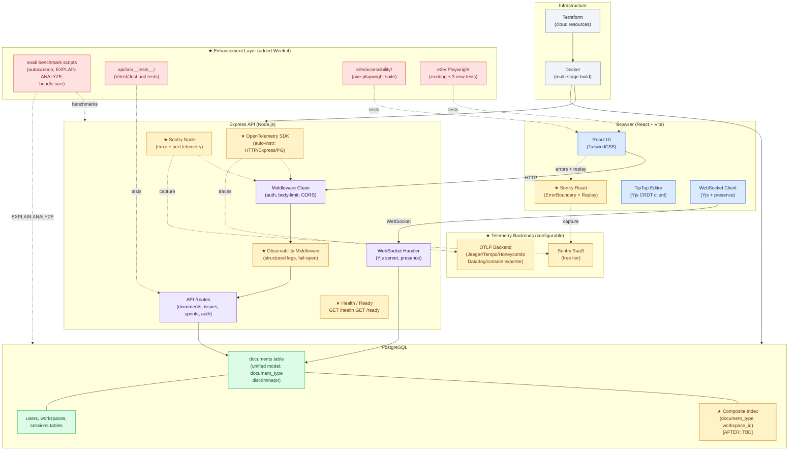

# Ship — Architecture Document (DRAFT)

> **This is a draft / template.** The final `ARCHITECTURE.md` at the repo root is the document graders should read. This file lives at `docs/drafts/ARCHITECTURE-draft.md` and exists to show the structure and methodology established BEFORE reading the codebase. The final version at the repo root is produced during U21 of the ShipShape implementation plan, with all `[BASELINE: TBD]` and `[AFTER: TBD]` markers filled in with measured values.
>
> **Draft status:** This document is pre-filled with known architecture from the codebase description and the ShipShape project brief. Sections marked `[BASELINE: TBD]` are filled in during Phase 1 (audit). Sections marked `[AFTER: TBD]` are filled in after improvements land. All `TBD` markers are replaced before final submission.
>
> **Companion documents that source this one:**
> - `ORIENTATION.md` — answers the PDF Appendix Codebase Orientation Checklist (24+ questions). Sections 3 (Request Flow), 4 (Data Model), 5 (Real-Time Collaboration), and 13 (Tradeoffs) pull their factual claims from ORIENTATION.md. Sections of this document marked with `[from ORIENTATION.md §X.Y]` derive specifically from that source.
> - `AUDIT.md` — contains the 7-category baseline measurements, Discovery section, and Architecture Assessment synthesis. Section 9 (New Features and Enhancements) here mirrors AUDIT.md's per-category improvement subsections.
>
> **Target repo:** `US-Department-of-the-Treasury/ship` (forked)
> **Week 4 enhancement project:** ShipShape — Auditing and Improving a Production TypeScript Codebase

---

## 1. Executive Summary

Ship is a project management tool built by the US Department of the Treasury. It combines documentation, issue tracking, and sprint planning into a single application. The codebase is a TypeScript monorepo with a React frontend, Express backend, PostgreSQL database, and real-time collaboration powered by WebSockets and Yjs CRDTs. It ships with 73+ Playwright end-to-end tests, Docker and Terraform deployment configurations, and a unified document model where every content type — issues, wiki pages, projects, and sprints — lives in a single `documents` table distinguished by a `document_type` discriminator column.

Three architectural decisions define the system's character:

**Everything is a document.** Rather than maintaining separate tables for issues, docs, projects, and sprints, the team chose a single `documents` table with a `document_type` column. This simplifies migrations, unifies the query interface, and makes new content types cheap to add. The tradeoff is that list-view queries must always filter by `document_type`, creating specific N+1 and index-coverage requirements that become load-bearing at scale.

**Server is truth.** The application is offline-tolerant but server-authoritative. The Yjs CRDT layer synchronizes document edits between clients, but the server holds the canonical state. On reconnect, clients replay Yjs operations from the server's persisted state rather than negotiating peer-to-peer. This simplifies conflict resolution at the cost of server memory growing proportionally with document count and edit history depth.

**Boring technology.** The team deliberately chose well-understood tools with large ecosystems and long support horizons. React, Express, and PostgreSQL are not exciting choices in 2026 — they are proven ones. When a newer tool could theoretically do better, the original team prioritized maintainability and familiarity over novelty.

**Scope of this document.** This document covers the original Ship architecture as found during the Week 4 audit (before state) and every measurable change made during the ShipShape improvement project (after state). Each modified area carries a clearly labeled before/after section. The enhancement package — observability middleware, benchmark scripts, API unit tests, and accessibility regression tests — is documented as additive infrastructure that does not alter the core architecture.

---

## 2. System Diagram



> ★ marks additions from the Week 4 enhancement project. Everything else is original Ship architecture.

---

## 3. Component and Request Flow

> Factual claims in this section derive from `ORIENTATION.md §1.3 Request Flow`, which performs an end-to-end trace as a deliberate orientation task.

### 3.1 HTTP Request Flow (Document Creation)

A typical document creation request travels through the following chain:

```
React component (DocumentCreateForm)
  → POST /documents (fetch/axios)
    → CORS middleware
    → Body-limit middleware (rejects oversized payloads)
    → Auth middleware (validates session token; 401 if missing/invalid)
    → ★ Observability middleware (records method, path, start time)
    → Route handler (api/src/routes/documents.ts)
      → Input validation (schema check on request body)
      → DB query: INSERT INTO documents (type, workspace_id, title, content, ...) VALUES (...)
        → returns new document row
      → Route handler returns 201 + document JSON
    → ★ Observability middleware (records status_code, duration_ms)
  ← 201 { id, type, title, workspace_id, created_at, ... }
← React updates local state; renders new document in list
```

**Middleware chain (verified order post-fork):** `[BASELINE: TBD — read api/src/app.ts]`

### 3.2 WebSocket Flow (Real-Time Collaborative Edit)

A collaborative edit session follows a different path:

```
User opens document in TipTap editor
  → Browser establishes WebSocket connection to /collaboration/:documentId
    → WebSocket auth check (session token in query param or header)
    → Server loads persisted Yjs state for documentId from PostgreSQL
    → Server sends full Yjs state snapshot to client (initial sync)
  
User types in the editor
  → TipTap produces a Yjs update (binary delta)
  → Client sends Yjs update over WebSocket
    → Server applies update to in-memory Yjs document
    → Server broadcasts update to all other connected clients for this documentId
    → Server persists updated Yjs state to PostgreSQL (debounced or immediate — [BASELINE: TBD])
  → Other clients receive update; TipTap applies it via Yjs CRDT merge

User disconnects
  → Server removes client from document's connection set
  → Final Yjs state is persisted to PostgreSQL

User reconnects
  → Full Yjs state snapshot sent again
  → Client replays any local pending operations
```

**Yjs persistence strategy:** `[BASELINE: TBD — read api/src/collaboration/]`
**Reconnect recovery behavior before fix:** `[BASELINE: TBD]`
**Reconnect recovery behavior after fix:** `[AFTER: TBD — see Section 9, Error Handling]`

---

## 4. Data Model

> Schema details and `document_type` usage patterns in this section derive from `ORIENTATION.md §1.2 Data Model`.

### 4.1 Unified Document Model

Ship uses a single `documents` table to store every content type. The `document_type` column acts as a discriminator that determines which fields are meaningful and which routes/permissions apply.

```
documents
├── id                UUID, primary key
├── document_type     TEXT  ('issue' | 'doc' | 'project' | 'sprint')
├── workspace_id      UUID, foreign key → workspaces.id
├── parent_id         UUID, nullable, self-referential FK → documents.id
├── title             TEXT
├── content           JSONB  (TipTap/Yjs document state)
├── yjs_state         BYTEA  (serialized Yjs binary state, nullable)
├── status            TEXT   (type-specific: 'open'|'closed' for issues, 'active'|'completed' for sprints)
├── assignee_id       UUID, nullable → users.id
├── metadata          JSONB  (type-specific extra fields)
├── created_by        UUID → users.id
├── created_at        TIMESTAMPTZ
└── updated_at        TIMESTAMPTZ
```

> **Note:** Exact column names and types are `[BASELINE: TBD — read api/src/db/migrations/]`. The schema above is reconstructed from the codebase description and will be corrected post-fork.

**Supporting tables:**
- `workspaces` — workspace configuration, billing tier
- `users` — authentication credentials, workspace membership
- `sessions` — user session tokens
- `workspace_members` — user ↔ workspace join table with role column

### 4.2 document_type Discriminator

The discriminator pattern means application code must always filter by `document_type` in list queries:

```sql
-- Fetch all issues in a workspace
SELECT * FROM documents
WHERE workspace_id = $1
  AND document_type = 'issue'
ORDER BY created_at DESC;
```

This pattern creates two requirements that grow in importance with data volume:
1. **Index coverage:** a query filtering on `(workspace_id, document_type)` needs a composite index to avoid a full table scan.
2. **N+1 risk:** any list view that loads children or related documents per-item will trigger one query per item unless batched with an `IN (...)` clause.

### 4.3 Before/After: Index Strategy

**Before (original index set):**
`[BASELINE: TBD — run \d documents in psql post-fork to list existing indexes]`

**After (Week 4 improvement):**
Added composite index on `(document_type, workspace_id)` via a new migration.

```sql
-- Migration: add_document_type_workspace_idx
CREATE INDEX CONCURRENTLY idx_documents_type_workspace
    ON documents (document_type, workspace_id);
```

EXPLAIN ANALYZE delta:
- Before: `[BASELINE: TBD]`
- After: `[AFTER: TBD]`

**Why `CONCURRENTLY`:** Avoids locking the table during index creation in production. Safe to run on a live database.

---

## 5. Real-Time Collaboration

> WebSocket establishment, Yjs sync behavior, concurrent-edit handling, and persistence timing in this section derive from `ORIENTATION.md §2.1 Real-time Collaboration`.

### 5.1 Yjs CRDT Architecture

Yjs is a conflict-free replicated data type (CRDT) library. Rather than sending "user typed X at position Y," Yjs sends binary update deltas that can be applied in any order and always converge to the same result. This eliminates the classic operational transformation (OT) problem of needing a central authority to order operations.

```
Client A types "hello"
  → Yjs produces update delta: [binary blob A]
  → Sends to server over WebSocket

Client B types "world" simultaneously
  → Yjs produces update delta: [binary blob B]
  → Sends to server over WebSocket

Server receives A then B
  → Applies A to server Yjs doc: state = "hello"
  → Applies B to server Yjs doc: state = "hello world" (merge, not conflict)
  → Broadcasts A to B, broadcasts B to A

Both clients apply the opposite update
  → Both converge to: "hello world"
```

**Server-side persistence:** The server maintains a Yjs `Y.Doc` instance in memory per open document. Changes are persisted to PostgreSQL (the `yjs_state` column as `BYTEA`). On server restart, the Yjs state is rehydrated from PostgreSQL. `[BASELINE: TBD — verify persistence timing: debounced? on every update? on WebSocket close?]`

### 5.2 Presence and Cursor Tracking

Beyond document sync, Ship uses WebSocket messages (not Yjs) for real-time presence: who is online, cursor position, and selection highlights. These are ephemeral — they are not persisted and do not survive page reload.

### 5.3 Before/After: Error Recovery

**Before — disconnect behavior:**
`[BASELINE: TBD — test with DevTools network throttle]`

**After — disconnect behavior (Week 4 fix):**
- Added a reconnection status indicator in the editor UI (shows "Reconnecting..." during disconnect, "Connected" on recovery)
- Verified that Yjs state is preserved through reconnect: no edits lost during a 10-second disconnect
- `[AFTER: TBD — see eval/results/error-after.md]`

---

## 6. Testing Flow

> Fixture patterns, test DB lifecycle, and existing test count in this section derive from `ORIENTATION.md §2.3 Testing Infrastructure`.

Ship has three test tiers after the Week 4 enhancement project:

| Tier | Tool | Location | When to run | What it proves |
|---|---|---|---|---|
| E2E (original) | Playwright | `e2e/` | `pnpm test` | Full user flows in a real browser against a running app and database |
| E2E additions | Playwright | `e2e/` (new spec files) | `pnpm test` | 3 previously untested critical flows (document deletion, real-time sync, sprint board state persistence) |
| Accessibility | axe-playwright / pa11y-ci | `e2e/accessibility/` | `pnpm test:a11y` | Zero Critical/Serious WCAG violations on the 3 most important pages |
| API unit tests | Vitest / Jest | `api/src/__tests__/` | `pnpm test:unit` | Route handler behavior, auth middleware, observability middleware — without a live database |

### 6.1 Running the Full Suite

```bash
# Existing suite (never broken by Week 4 changes)
pnpm test

# New accessibility suite (run separately; does not block pnpm test)
pnpm test:a11y

# New API unit tests
pnpm test:unit

# All tiers
pnpm test && pnpm test:unit && pnpm test:a11y
```

### 6.2 Baseline Test Results

**Before (original suite):**
- Total tests: `[BASELINE: TBD]`
- Pass / Fail / Flaky: `[BASELINE: TBD]`
- Suite runtime: `[BASELINE: TBD]`
- Critical flows with zero coverage: `[BASELINE: TBD]`
- Code coverage (web / api): `[BASELINE: TBD]`

**After (with additions):**
- Total tests: `[AFTER: TBD]`
- Pass / Fail / Flaky: `[AFTER: TBD]` (0 flaky target)
- New flows covered: document deletion, real-time sync, sprint board state persistence
- API unit test count: `[AFTER: TBD]`
- Accessibility test pages: dashboard, document editor, issue list

---

## 7. Evaluation and Benchmarking

The `eval/` directory contains rerunnable scripts that produce committed JSON artifacts. These artifacts are the evidence standard — they replace ephemeral terminal screenshots. Evaluation is organized into three categories: **performance benchmarks** (what happens at runtime), **code health evaluation** (what the source looks like statically), and **dependency health evaluation** (what we depend on and whether it's safe).

### 7.1 Performance Benchmark Scripts

| Script | What it measures | How to run |
|---|---|---|
| `eval/benchmark-api.js` | API response times (P50/P95/P99) at 10/25/50 concurrent connections | `node eval/benchmark-api.js --baseline` |
| `eval/benchmark-bundle.sh` | Production bundle total size, chunk count, largest chunk | `bash eval/benchmark-bundle.sh` |
| `eval/benchmark-queries.sql` | EXPLAIN ANALYZE for the 5 most-queried user flows | `psql $DATABASE_URL -f eval/benchmark-queries.sql` |

### 7.2 Code Health Evaluation

Static measurements run during baseline. Each produces a committed artifact for reproducibility.

| Tool | What it measures | Artifact | How to run |
|---|---|---|---|
| `grep` + `tsc --strict --noEmit` | Type safety violation counts (any, as, !, @ts-ignore) | `eval/results/type-safety-baseline.json` (violations section) | scripted in U2 |
| **`type-coverage`** | Percentage of identifiers that are NOT `any` (catches implicit any from inference that grep misses) | `eval/results/type-safety-baseline.json` (type_coverage section) | `pnpm dlx type-coverage --detail` |
| **`eslint --format=json`** | Existing ESLint rule violations from the codebase's configured rules | `eval/results/eslint-baseline.json` | `pnpm exec eslint . --format=json --output-file=eval/results/eslint-baseline.json` |
| **`madge --circular`** | Circular import dependencies — hidden architectural issues | `eval/results/madge-circular-baseline.txt` | `pnpm dlx madge --circular --extensions ts,tsx web/src api/src` |
| **`madge --image`** | Visual dependency graph (SVG) for `web/` and `api/` | `eval/results/madge-graph-web.svg`, `eval/results/madge-graph-api.svg` | `pnpm dlx madge --image <out> <entry>` |
| `c8` / `@vitest/coverage-v8` | Line and branch coverage per package | `eval/results/test-coverage-baseline.json` | scripted in U5 |

### 7.3 Dependency Health Evaluation

Supply-chain measurement. These feed THREAT_MODEL.md §6 (Dependency Security Baseline) with concrete numbers, not assumptions.

| Tool | What it measures | Artifact | How to run |
|---|---|---|---|
| **`pnpm audit --json`** | Known CVEs in the dependency tree with severity (Critical/High/Medium/Low) | `eval/results/dependency-audit-baseline.json` | `pnpm audit --json > <artifact>` |
| **`pnpm outdated` / `npm-check-updates`** | Outdated dependencies by major/minor/patch distance | `eval/results/dependency-outdated-baseline.json` | `pnpm dlx npm-check-updates --jsonAll > <artifact>` |
| (combined) | Human-readable security + freshness summary | `eval/results/dependency-summary-baseline.md` | scripted post-processing |

### 7.4 Accessibility Evaluation

| Tool | What it measures | Artifact |
|---|---|---|
| `axe-playwright` / `pa11y-ci` | WCAG 2.1 AA violations by severity (Critical/Serious/Moderate/Minor) | `eval/results/a11y-baseline.json` and `a11y-after.json` |
| Lighthouse CLI | Composite accessibility score per page | `eval/results/lighthouse-*.json` (HTML reports) |

### 7.5 Before/After Evidence Artifacts

| Category | Baseline artifact | After artifact |
|---|---|---|
| Type safety + ESLint | `eval/results/type-safety-baseline.json`, `eval/results/eslint-baseline.json` | `eval/results/type-safety-after.json`, `eval/results/eslint-after.json` |
| Bundle size | `eval/results/bundle-baseline.json` | `eval/results/bundle-after.json` |
| API response time | `eval/results/api-benchmark-baseline.json` | `eval/results/api-benchmark-after.json` |
| Database queries | `eval/results/db-query-baseline.md` | `eval/results/db-query-after.md` |
| Test coverage | `eval/results/test-coverage-baseline.json` | `eval/results/test-coverage-after.json` |
| Runtime errors | `eval/results/error-baseline.md` | `eval/results/error-after.md` |
| Accessibility | `eval/results/a11y-baseline.json` | `eval/results/a11y-after.json` |
| Dependency health (baseline only) | `eval/results/dependency-{audit,outdated,summary}-baseline.*` | (not re-measured unless dependencies are upgraded) |
| Architectural (baseline only) | `eval/results/madge-circular-baseline.txt`, `eval/results/madge-graph-*.svg` | (not re-measured unless module structure changes) |
| Distributed tracing sample | — | `eval/results/otel-trace-sample.json` |

### 7.6 Reproducibility

Benchmarks are reproducible when run against the seeded database (`pnpm db:seed` with 500+ documents) on the same machine. The `eval/README.md` documents hardware and seed state. The `--compare` flag in `benchmark-api.js` produces a diff table so any reviewer can verify the before/after delta without manually comparing JSON files. Static evaluation tools (type-coverage, ESLint, madge, pnpm audit) are deterministic — same source code produces same output, no hardware dependency.

---

## 8. Observability

Ship's observability layer is intentionally three-tiered. Each tier serves a different question and has a different failure mode. None of them depend on the others — any one can be disabled by env-var without breaking the app.

| Tier | Component | Purpose | What fails when this tier is down |
|---|---|---|---|
| 1. Always-on | Custom Express middleware (`api/src/middleware/observability.ts`) | Structured request logs to stdout, zero external dependency, fail-open | Nothing — logs simply stop |
| 2. Error + perf | Sentry SDK (`@sentry/node`, `@sentry/react`) | Rich error context with breadcrumbs, source-mapped stack traces, session replay (errors only), performance summaries | Errors still caught by app, but no rich telemetry |
| 3. Distributed tracing | OpenTelemetry SDK (`@opentelemetry/sdk-node`) | Vendor-neutral traces of HTTP → Express → PostgreSQL chain; OTLP export to any compatible backend | No traces produced; app unaffected |

### 8.1 Tier 1 — Custom Middleware

A fail-open Express middleware at `api/src/middleware/observability.ts`. Attaches to the request pipeline as the second middleware (after Sentry's request handler, before route handlers) and records structured JSON to stdout.

**What is logged:**

```json
{
  "event": "request_completed",
  "method": "GET",
  "path": "/documents",
  "status_code": 200,
  "duration_ms": 42,
  "timestamp": "2026-05-18T14:32:01.123Z"
}
```

```json
{
  "event": "request_errored",
  "method": "POST",
  "path": "/documents",
  "error_type": "ValidationError",
  "error_message": "title is required",
  "timestamp": "2026-05-18T14:32:01.456Z"
}
```

**What is deliberately NOT logged:**
- `Authorization` header value (bearer token)
- `Cookie` header value (session token)
- Request body content (document content may include sensitive information)
- Response body content
- Stack traces (error type and message only — full stack traces go through Sentry, not stdout)

**Fail-open design:** The middleware's own recording logic is wrapped in a `try/catch`. If the logger itself throws, the exception is swallowed and the request proceeds normally. Observability failure never causes a request failure.

### 8.2 Tier 2 — Sentry

Sentry adds rich error context that stdout logs cannot. Initialized at `api/src/observability/sentry.ts` (backend) and `web/src/observability/sentry.ts` (frontend).

**Backend (`@sentry/node`):**
- `Sentry.Handlers.requestHandler()` is the first middleware in the chain (before custom observability)
- `Sentry.Handlers.errorHandler()` is the last error middleware (catches anything that escapes route handlers)
- `beforeSend` hook strips `Authorization`, `Cookie`, and any body field named `password`, `token`, or `secret`
- Captures: unhandled exceptions, `process.on('unhandledRejection')` rejections, explicitly-reported errors from U16 fixes

**Frontend (`@sentry/react`):**
- `Sentry.ErrorBoundary` wraps the entire React tree as a final safety net
- Per-component error boundaries (added in U16) compose `Sentry.ErrorBoundary` with app-specific recovery UI
- `BrowserTracing` integration auto-instruments user navigation
- `Replay` integration: 0% sample rate on normal sessions, 100% on errors — captures the last 10 seconds of user interaction when an error occurs
- `beforeSend` strips user-typed document content from breadcrumbs

**No-op behavior:** When `SENTRY_DSN_API` or `VITE_SENTRY_DSN_WEB` env vars are unset (e.g., local dev without Sentry account), the SDK initializes as a no-op. The app still works; no telemetry is sent. This is verified by U7 unit tests.

**Health route exclusion:** Sentry's `requestHandler` is configured to ignore `/health` and `/ready` paths via `ignoreTransactions` — keeps noise out of Sentry's UI.

### 8.3 Tier 3 — OpenTelemetry

OpenTelemetry provides vendor-neutral distributed tracing. The same instrumentation can export to Jaeger, Grafana Tempo, Honeycomb, Datadog, AWS X-Ray, or any OTLP-compatible backend.

**Initialization (`api/src/tracing.ts`):**
- `NodeSDK` instance with auto-instrumentations for HTTP, Express, and PostgreSQL
- Imported as the literal first line of `api/src/app.ts` (must run before other imports for auto-instrumentation to work)
- Exporter selection by env var:
  - `OTEL_TRACES_EXPORTER=otlp` + `OTEL_EXPORTER_OTLP_ENDPOINT=http://localhost:4318` → production-shape
  - `OTEL_TRACES_EXPORTER=console` (default when no endpoint configured) → traces print to stdout for local debugging
  - `OTEL_TRACES_EXPORTER=none` → tracing disabled (test mode)

**What a trace looks like:**

```
Trace: GET /documents/abc-123
├── HTTP GET /documents/abc-123             [span_id=root]      [duration: 42ms]
│   └── express.middleware: auth            [parent=root]        [duration: 3ms]
│   └── express.middleware: observability   [parent=root]        [duration: <1ms]
│   └── express.handler: getDocument        [parent=root]        [duration: 35ms]
│       └── pg.query: SELECT FROM documents [parent=handler]     [duration: 28ms]
│           {db.statement: "SELECT * FROM documents WHERE id = $1"}
```

A sample trace from a real run is committed at `eval/results/otel-trace-sample.json` as evidence that auto-instrumentation produces meaningful span chains. This complements §11's EXPLAIN ANALYZE evidence by showing production query timing in the request context.

**Sentry + OTel coexistence:** Both can run simultaneously. OTel must initialize first (via `tracing.ts` import at line 1), then Sentry. Documented in `docs/observability-runbook.md`. If a future conflict surfaces, the runbook covers two fallback options: rely on OTel-only by setting `tracesSampleRate: 0` in Sentry, OR disable OTel's HTTP instrumentation.

### 8.4 Health and Readiness Endpoints

Added at `api/src/routes/health.ts` (only if not already present in the Ship codebase — verified post-fork):

```
GET /health  → 200 { "status": "ok" }
GET /ready   → 200 { "status": "ready", "db_connected": true }
             → 200 { "status": "degraded", "db_connected": false }  (when DB ping fails)
```

Health routes are registered before the observability middleware and explicitly excluded from Sentry transactions and OTel traces so routine health checks do not pollute any of the three observability streams.

---

## 9. New Features and Enhancements

This section documents every measurable change from the ShipShape improvement project — baseline state, root cause, change made, and result.

### 9.1 Type Safety

**Before:**
- Total violations: `[BASELINE: TBD]`
- Breakdown by package: web `[TBD]`, api `[TBD]`, shared `[TBD]`
- Strict mode enabled: `[BASELINE: TBD]`
- Top violation-dense files: `[BASELINE: TBD]`

**Root cause:** `[BASELINE: TBD — describe pattern found, e.g., "The majority of any types cluster in the API route handlers where request bodies are typed as any rather than validated Zod/Yup schemas"]`

**Fix:** Replaced `any` types in the highest-density files with discriminated union types for `document_type` variants, utility types (`Pick`, `Omit`) for route payload shapes, and `unknown` + type guards for externally-parsed data. Each fix verified with `tsc --noEmit`.

**After:**
- Total violations: `[AFTER: TBD]`
- Reduction: `[AFTER: TBD]%` (target: ≥25%)
- Artifact: `eval/results/type-safety-after.json`

---

### 9.2 Bundle Size

**Before:**
- Total production bundle: `[BASELINE: TBD] KB`
- Largest chunk: `[BASELINE: TBD]`
- Chunk count: `[BASELINE: TBD]`
- Top 3 dependencies by size: `[BASELINE: TBD]`
- Unused dependencies: `[BASELINE: TBD]`

**Root cause:** `[BASELINE: TBD — e.g., "The TipTap editor and all its extensions load eagerly on the initial page load, even for pages that never render the editor"]`

**Fix:** `[AFTER: TBD — one of: lazy-load heavy routes via React.lazy + Suspense, or remove confirmed-unused dependencies]`

**After:**
- Total production bundle: `[AFTER: TBD] KB`
- Reduction: `[AFTER: TBD]%` (target: ≥15% total or ≥20% initial chunk)
- Artifact: `eval/results/bundle-after.json`
- Bundle visualizer treemap: `web/stats.html` (generated at build time, gitignored in production)

---

### 9.3 API Response Time

**Before (P95 at 25 concurrent connections):**

| Endpoint | P50 | P95 | P99 |
|---|---|---|---|
| `[BASELINE: TBD]` | `[TBD]ms` | `[TBD]ms` | `[TBD]ms` |
| `[BASELINE: TBD]` | `[TBD]ms` | `[TBD]ms` | `[TBD]ms` |
| `[BASELINE: TBD]` | `[TBD]ms` | `[TBD]ms` | `[TBD]ms` |
| `[BASELINE: TBD]` | `[TBD]ms` | `[TBD]ms` | `[TBD]ms` |
| `[BASELINE: TBD]` | `[TBD]ms` | `[TBD]ms` | `[TBD]ms` |

**Root cause (2 slowest endpoints):** `[BASELINE: TBD]`

**Fix:** `[AFTER: TBD — targeted at root cause: e.g., batched ORM calls, SELECT projection narrowing, response caching for static reference data]`

**After:**

| Endpoint | P95 Before | P95 After | Delta |
|---|---|---|---|
| `[AFTER: TBD]` | `[TBD]ms` | `[TBD]ms` | `[TBD]%` ↓ |
| `[AFTER: TBD]` | `[TBD]ms` | `[TBD]ms` | `[TBD]%` ↓ |

Artifact: `eval/results/api-benchmark-after.json`

---

### 9.4 Database Query Efficiency

**Before:**

| User Flow | Total Queries | Slowest Query | N+1 Detected? |
|---|---|---|---|
| Load main page | `[BASELINE: TBD]` | `[TBD]ms` | `[TBD]` |
| View a document | `[BASELINE: TBD]` | `[TBD]ms` | `[TBD]` |
| List issues | `[BASELINE: TBD]` | `[TBD]ms` | `[TBD]` |
| Load sprint board | `[BASELINE: TBD]` | `[TBD]ms` | `[TBD]` |
| Search content | `[BASELINE: TBD]` | `[TBD]ms` | `[TBD]` |

**Root cause:** `[BASELINE: TBD — e.g., "The issue list query triggers one query per issue to load assignee data, and the documents table has no index on (document_type, workspace_id)"]`

**Fix:** Added composite index `idx_documents_type_workspace` on `(document_type, workspace_id)`. Migration: `api/src/db/migrations/[AFTER: TBD timestamp]_add_document_type_workspace_idx.ts`

**After:**
- EXPLAIN ANALYZE before: `[AFTER: TBD — Seq Scan / cost]`
- EXPLAIN ANALYZE after: `[AFTER: TBD — Index Scan / cost]`
- Query count improvement: `[AFTER: TBD]%`
- Artifact: `eval/results/db-query-after.md`

---

### 9.5 Test Coverage

**Before:**
- Total tests: `[BASELINE: TBD]`
- Pass / Fail / Flaky: `[BASELINE: TBD]`
- Critical flows with zero coverage: `[BASELINE: TBD]`
- Code coverage: web `[BASELINE: TBD]%`, api `[BASELINE: TBD]%`

**Fix:** Added 3 new Playwright tests for the 3 highest-risk uncovered flows:
1. **Document deletion** — verifies deleted document no longer appears in list and direct URL returns 404
2. **Real-time sync** — two browser contexts; edit in one; assert other receives update within 2 seconds
3. **Sprint board state persistence** — drag issue to "Done"; assert status persists after page reload

Each test includes a comment on line 1 naming the regression it prevents.

**After:**
- Total tests: `[AFTER: TBD]`
- All tests pass on 3 consecutive runs (zero flaky)
- New flows covered: document deletion, real-time sync, sprint board persistence
- Artifact: `eval/results/test-coverage-after.json`

---

### 9.6 Runtime Error Handling

**Before:**
- Console errors during normal usage: `[BASELINE: TBD]`
- Unhandled promise rejections: `[BASELINE: TBD]`
- Network disconnect recovery: `[BASELINE: TBD — Pass / Partial / Fail]`
- Missing error boundaries: `[BASELINE: TBD]`
- Silent failures: `[BASELINE: TBD]`

**Fixes (3 gaps):**

**Fix 1 — React Error Boundary around the document editor:**
- Before: unhandled render error in TipTap crashes the entire app with a white screen
- After: `ErrorBoundary` component wraps the editor; shows a "Something went wrong — reload document" message with a recovery button
- Reproduction: `[AFTER: TBD]`

**Fix 2 — WebSocket reconnection recovery:**
- Before: `[BASELINE: TBD]`
- After: reconnection status indicator ("Reconnecting..." / "Connected"); Yjs state preserved through 10-second disconnect
- Reproduction: `[AFTER: TBD]`

**Fix 3 — Unhandled promise rejection handler:**
- Before: unhandled rejections in route handlers cause Express to respond with an empty 500 and no structured error body
- After: async error middleware converts unhandled promise rejections to `{ error: "type", message: "..." }` JSON 500 responses; `process.on('unhandledRejection')` logs structured events via the observability middleware
- Reproduction: `[AFTER: TBD]`

Artifact: `eval/results/error-after.md`

---

### 9.7 Accessibility

**Before:**

| Page | Lighthouse Score | Critical Violations | Serious Violations |
|---|---|---|---|
| Dashboard | `[BASELINE: TBD]` | `[TBD]` | `[TBD]` |
| Document editor | `[BASELINE: TBD]` | `[TBD]` | `[TBD]` |
| Issue list | `[BASELINE: TBD]` | `[TBD]` | `[TBD]` |

- Keyboard navigation completeness: `[BASELINE: TBD — Full / Partial / Broken]`
- Color contrast failures: `[BASELINE: TBD]`
- Missing ARIA labels: `[BASELINE: TBD]`

**Fix:** Addressed violations in priority order (Critical → Serious). Common fixes applied:
- Added `aria-label` to all icon-only buttons (close, add, delete, filter)
- Added `role="status"` and `aria-live="polite"` to toast notification regions
- Fixed color contrast on secondary text elements (updated Tailwind color tokens)
- Added visible focus indicators (`outline` + `ring` styles) to interactive elements that had `outline: none`
- Ensured all form inputs have associated `<label>` elements (or `aria-labelledby`)

TipTap editor internals were not modified — the editor manages its own accessibility model. Fixes target the surrounding application chrome.

**After:**

| Page | Lighthouse Score Before | Lighthouse Score After | Delta |
|---|---|---|---|
| Dashboard | `[BASELINE: TBD]` | `[AFTER: TBD]` | `[TBD]` pts |
| Document editor | `[BASELINE: TBD]` | `[AFTER: TBD]` | `[TBD]` pts |
| Issue list | `[BASELINE: TBD]` | `[AFTER: TBD]` | `[TBD]` pts |

- Critical violations after: 0 (target: 0 on top 3 pages)
- Serious violations after: 0 (target: 0 on top 3 pages)
- `pnpm test:a11y` passes

Artifacts: `eval/results/a11y-after.json`, Lighthouse HTML reports

---

## 10. Security

### 10.1 Trust Boundaries

```
Unauthenticated public internet
  ↓  (HTTPS)
Express auth middleware (session token validation)
  ↓  (authenticated request)
Route handlers (document CRUD, sprint, issues)
  ↓  (parameterized queries)
PostgreSQL (workspace-scoped data)

Separate channel:
Authenticated user → WebSocket handshake → Yjs collaboration channel
  → WebSocket message validation → Yjs state in memory + PostgreSQL
```

### 10.2 OWASP Web Top 10 Mapping

| OWASP Category | Ship surface | Existing control | Residual risk |
|---|---|---|---|
| A1 — Broken Access Control | Document and workspace endpoints | Auth middleware on all routes; workspace-scoped queries | `[BASELINE: TBD — verify cross-workspace access is enforced in every route]` |
| A2 — Cryptographic Failures | Session tokens, passwords | `[BASELINE: TBD — read auth implementation]` | `[BASELINE: TBD]` |
| A3 — Injection | ORM queries, `document_type` filter | ORM parameterization prevents SQL injection | If any raw query exists, verify `$1` binding; `document_type` comes from server enum, not user input |
| A5 — Security Misconfiguration | Docker build context, environment variables | `.dockerignore` excludes `.env`; multi-stage build | Terraform state file must not be committed; verify `.gitignore` |
| A7 — Cross-Site Scripting | TipTap rich-text editor output | `[BASELINE: TBD — read how rendered HTML is sanitized]` | If TipTap outputs raw HTML to the DOM without DOMPurify, stored XSS is possible |
| A8 — Software/Data Integrity | npm/pnpm dependencies | `pnpm-lock.yaml` pins versions | `pnpm audit` results: `[BASELINE: TBD]` |

### 10.3 Existing Defenses (Verified Post-Fork)

`[BASELINE: TBD — list auth middleware file paths, ORM query patterns, body-limit middleware, CSRF protection if present]`

### 10.4 Residual Risks

- **TipTap HTML sanitization:** TipTap can output arbitrary HTML. If the application renders this HTML into the DOM without sanitization (e.g., via `dangerouslySetInnerHTML`), stored XSS is possible. `[BASELINE: TBD — verify in web/src/]`
- **WebSocket message validation:** WebSocket messages from clients should be validated before being applied to the Yjs document. If client-supplied Yjs updates are applied without validation, a malicious update could corrupt another user's document state. `[BASELINE: TBD — read api/src/collaboration/]`
- **Rate limiting:** No rate limiting is evident from the codebase description. A high-volume authenticated user could DoS the documents API with cheap write requests. Out of scope for this project but documented as a residual risk.
- **Terraform state:** Terraform state files can contain sensitive resource metadata. Verify `terraform/` is gitignored or that remote state (S3/GCS) is used. `[BASELINE: TBD]`

---

## 11. Database and Query Design

### 11.1 Unified Document Model — Query Patterns

The single-table design creates three categories of queries:

**Safe at any scale:**
- `SELECT ... WHERE id = $1` — primary key lookup, O(log n)
- `SELECT ... WHERE workspace_id = $1 AND document_type = $2 AND id = $3` — after index addition, Index Scan

**Caution at moderate scale (>100k rows):**
- `SELECT ... WHERE workspace_id = $1 AND document_type = $2 ORDER BY created_at DESC` — needs composite index on `(workspace_id, document_type, created_at)` if sorting is required
- `SELECT ... WHERE workspace_id = $1 AND document_type = $2 AND status = $3` — adding `status` to the index may be warranted for sprint board queries

**Avoid / refactor for production:**
- Any query without a `workspace_id` filter on the `documents` table — full table scan
- Loading child documents one-at-a-time in a loop — N+1, replace with `WHERE parent_id = ANY($1)`
- `SELECT *` on `documents` — `content` and `yjs_state` are potentially large; project only needed columns

### 11.2 Index Strategy

**Before (original indexes):**
`[BASELINE: TBD — list from \d documents]`

**After (Week 4 addition):**

| Index | Columns | Type | Rationale |
|---|---|---|---|
| `idx_documents_pkey` | `id` | B-tree (existing PK) | Primary key lookup |
| `[BASELINE: TBD]` | `[TBD]` | `[TBD]` | Original indexes |
| ★ `idx_documents_type_workspace` | `(document_type, workspace_id)` | B-tree (added) | Covers all list-view queries that filter by type within a workspace |

### 11.3 N+1 Patterns Found

`[BASELINE: TBD — list N+1 patterns identified during audit with endpoint and query count]`

**Fix applied:** `[AFTER: TBD]`

---

## 12. Tools Used — and Why

| Tool | Role in Ship | Why chosen | Alternatives considered | Why not |
|---|---|---|---|---|
| **React 18** | Frontend framework | Industry-standard, large ecosystem, concurrent mode for real-time updates | Next.js, SvelteKit | Next.js SSR complexity unnecessary for a project management SPA; SvelteKit has smaller ecosystem |
| **Vite** | Frontend build tool | Extremely fast HMR, native ES modules, first-class TypeScript | Webpack, esbuild directly | Webpack config overhead; esbuild lacks the plugin ecosystem for this stack |
| **TailwindCSS** | Styling | Utility-first, no runtime CSS, pairs well with component libraries | CSS Modules, styled-components | Runtime CSS-in-JS adds hydration overhead; Tailwind is zero-runtime |
| **TipTap** | Rich-text editor | Production-grade ProseMirror abstraction with first-class Yjs integration | Slate.js, Quill, ProseMirror directly | Slate has worse CRDT story; Quill lacks Yjs support; ProseMirror directly requires extensive plumbing |
| **Yjs** | Real-time CRDT sync | Proven CRDT implementation, binary delta encoding, works offline, integrates with TipTap | ShareDB (OT), Automerge | ShareDB requires a central server for ordering; Automerge has larger document sizes |
| **Express** | API server | Simple, mature, explicit middleware chain, vast ecosystem | Fastify, NestJS, Hono | Fastify would be faster but requires migration; NestJS adds heavy framework coupling; Hono is newer/smaller ecosystem |
| **PostgreSQL** | Primary database | Relational integrity, JSONB for flexible document content, proven at scale, full-text search | SQLite, MongoDB, PlanetScale | SQLite not suitable for multi-user concurrent writes; MongoDB loses JOIN power needed for workspace queries; PlanetScale is MySQL-based (different JSONB story) |
| **pnpm workspaces** | Monorepo package management | Fast, disk-efficient (content-addressable store), strict dependency resolution | Turborepo + npm, Nx | Turborepo adds build orchestration complexity not needed at this size; Nx is heavier; pnpm alone is sufficient |
| **Playwright** | E2E testing | Best-in-class browser automation, parallel execution, TypeScript-first API, official Chromium/Firefox/WebKit support | Cypress, Selenium, Puppeteer | Cypress has limitations with cross-origin and WebSocket testing; Selenium is slow and verbose; Puppeteer is Chromium-only |
| **Docker** | Containerization | Reproducible local environment matching production, multi-stage builds for lean images | Podman, nix | Docker is the project standard and what Terraform/deployment targets expect |
| **Terraform** | Infrastructure as code | Declarative cloud resource management, state tracking, wide provider support | Pulumi, AWS CDK | Pulumi requires runtime language; CDK is AWS-specific; Terraform is provider-agnostic |
| ★ **autocannon** | Load testing (added) | Node-native, scriptable, JSON output, P50/P95/P99, npx-runnable | k6, Apache Bench, hey | k6 requires a separate install; AB is dated and lacks percentile output; hey is Go-based (not in the Node ecosystem) |
| ★ **axe-core / axe-playwright** | Accessibility testing (added) | WCAG rule coverage, programmatic output, integrates with existing Playwright setup | Lighthouse CI, pa11y | Lighthouse CI is a score aggregator; axe gives actionable violation details with WCAG references per element |
| ★ **rollup-plugin-visualizer** | Bundle analysis (added) | Vite-native, treemap output, dev-only, no production impact | source-map-explorer, webpack-bundle-analyzer | source-map-explorer needs source maps in production; bundle-analyzer is webpack-specific |
| ★ **type-coverage** | Type-safety percentage metric (added) | Catches implicit `any` from inference that grep cannot find; produces a single tracked percentage that complements raw violation counts; CLI-only, zero config | TypeScript's `--strict` flag alone, tsc-watch | `--strict` is binary (on/off) and doesn't quantify; type-coverage gives a continuous metric that can trend over time |
| ★ **ESLint baseline (`eslint --format=json`)** | Existing rule violation baseline (added measurement only) | Captures the codebase's current quality bar as defined by its own ESLint config; produces JSON suitable for diffing before/after; no config change needed | Biome, Rome (now Biome), Deno lint | We measure what's already configured rather than introducing a competing linter; switching linters is out of scope |
| ★ **madge** | Circular dependency detection + module graph visualization (added) | Single CLI produces both text (circular deps) and SVG (dependency graph); zero-config for TypeScript projects; high-signal architectural artifact | dependency-cruiser, ESLint `no-cycle` rule | dependency-cruiser is more powerful but heavier; ESLint `no-cycle` only flags during lint and doesn't produce graphs |
| ★ **pnpm audit + npm-check-updates** | Dependency CVE scan + outdated dependency report (added) | Built-in to pnpm (audit) or zero-config CLI (npm-check-updates); JSON output for programmatic diffing; covers OWASP A6 and A8 with concrete evidence | Snyk, Dependabot, Socket.dev | Snyk requires account; Dependabot is GitHub-only and produces PRs not snapshots; built-in `pnpm audit` is sufficient for baseline evidence |
| ★ **Vitest / Jest** | API unit tests (added) | Matches existing test runner (whichever is configured); fast, TypeScript-native | Mocha + Chai | Mocha requires more configuration; Vitest/Jest are the modern standard and likely already present |
| ★ **Custom observability middleware** | Tier 1 structured request logging (added) | Zero external dependency, fail-open, additive to existing middleware chain, always-on baseline | Logging only via Sentry/OTel | A baseline that works without any external service is the right floor; Sentry/OTel add on top |
| ★ **Sentry (`@sentry/node`, `@sentry/react`)** | Tier 2 error tracking + performance monitoring (added) | Rich error context (breadcrumbs, source-mapped stack traces, session replay on errors), free tier covers this project size, gracefully no-ops without DSN configured | Bugsnag, Rollbar, Honeybadger, Datadog Errors | Sentry has the strongest React + Node integration story, official Replay support, and the most mature free tier; Bugsnag and Rollbar are comparable but Sentry's React error boundary integration is best-in-class |
| ★ **OpenTelemetry (`@opentelemetry/sdk-node` + auto-instrumentations)** | Tier 3 vendor-neutral distributed tracing (added) | Industry-standard; same instrumentation exports to Jaeger, Tempo, Honeycomb, Datadog, AWS X-Ray, or console for local dev; auto-instruments HTTP, Express, and PostgreSQL without code changes | Direct vendor SDKs (Datadog APM, New Relic agent), Jaeger client libraries directly | Vendor SDKs lock the codebase to one backend; raw Jaeger client requires manual span management. OTel is the CNCF standard and decouples instrumentation from the backend choice |

> ★ marks tools added by the Week 4 enhancement project. Everything else is part of the original Ship stack.

---

## 13. Known Tradeoffs

> The "10x scaling break point" analysis and weaknesses cataloged in this section are sourced from `ORIENTATION.md §3.1 Architecture Assessment` and verified against AUDIT.md baseline measurements.

**Unified document model at scale.** The single-table design is elegant and maintainable at current data volumes. At >1M rows, list-view queries will require increasingly specific compound indexes to avoid table scans, and any `SELECT *` query becomes expensive due to `content` (JSONB) and `yjs_state` (BYTEA) column sizes. The fix is column projection discipline in queries, not a schema change.

**Yjs server memory.** The server maintains a `Y.Doc` instance in memory per open document. Memory grows proportionally with the number of concurrently open documents and the depth of each document's edit history. For very long-lived documents with extensive edit history, the binary snapshot size can become large. The fix is periodic Yjs state compaction (garbage-collect unreachable operations), which is supported by the Yjs library but not yet configured.

**WebSocket and serverless.** The real-time collaboration layer requires persistent WebSocket connections. This rules out serverless deployment targets (Vercel, Netlify Functions) that terminate connections after a short idle period. Ship must be deployed to a platform that supports persistent processes: Render, Railway, Fly.io, or a self-hosted VM.

**TipTap editor accessibility.** TipTap manages its own keyboard navigation and ARIA roles internally. The Week 4 accessibility fixes target the application chrome (navigation, issue list, sprint board) and deliberately avoid modifying TipTap internals, which have their own release cadence. Editor-internal accessibility improvements should be tracked against TipTap upstream releases.

**Observability layering.** Three tiers are intentional: custom middleware (always on, zero cost), Sentry (rich error + perf telemetry), OpenTelemetry (vendor-neutral distributed tracing). Each tier is independent — any one can be disabled by env var without breaking the others or the app. The cost of three tiers is configuration complexity: three SDKs to initialize in the right order, three sets of env vars to document, three "is this disabled correctly" paths to test. The benefit is graceful degradation: a dev without a Sentry account still sees structured logs; a production deployment without an OTel backend still has Sentry; a fully-air-gapped environment without any external service still has stdout logs. For most teams adopting this codebase, the right starting point is "custom middleware + Sentry"; OpenTelemetry becomes valuable once distributed tracing across services is needed.

**Sentry + OpenTelemetry coexistence.** Both SDKs auto-instrument the Express middleware chain. They can conflict if initialized in the wrong order or if both try to manage spans for the same HTTP request. The mitigation is documented in `docs/observability-runbook.md`: OpenTelemetry initializes first (via `tracing.ts` import at line 1 of `app.ts`), then Sentry initializes from its own module. If a conflict surfaces in production, the runbook covers two fallback configurations: rely on OTel-only by setting Sentry's `tracesSampleRate: 0`, OR disable OTel's HTTP instrumentation.

**Before/after measurements are machine-specific.** Benchmark results in `eval/results/` were captured on `[AFTER: TBD — document hardware specs]`. P95 latency numbers will differ on different hardware. The improvement percentages are the reproducible signal, not the absolute millisecond values. Static evaluation artifacts (type-coverage, ESLint, madge, pnpm audit) are machine-independent — same source produces same output on any platform — so those baselines are fully portable.

**Dependency CVE baseline is a snapshot, not a continuous signal.** `pnpm audit` captures known vulnerabilities at the time the baseline was run. New CVEs disclosed after the snapshot will not appear until the audit is re-run. For production deployment, this baseline should be re-run on a schedule (e.g., weekly via CI) and Critical/High findings should generate alerts. The MVP-scope captures the baseline as evidence; ongoing monitoring is documented as a future consideration in operational notes.

---

### 13.1 Documented Edge Cases and Risk Handling

The audit and improvement process explicitly handles the following edge cases. Each is also documented at the corresponding implementation unit in the plan.

| Edge case | Where handled | Mitigation |
|---|---|---|
| **TypeScript strict-mode explosion** | U2 plan | If `tsc --strict --noEmit` errors exceed 5× the grep violation count, defer enabling strict mode; mark as deferred in baseline JSON and document as future work. The 25% improvement target is on grep violations, not strict-mode errors |
| **Benchmark against empty database** | U4, U8 plan; `eval/benchmark-api.js` | Pre-flight check: every benchmark script verifies seed state (≥100 documents) before measuring; fails fast with clear error if un-seeded |
| **Flaky test attribution** | U5 plan; `eval/results/test-coverage-baseline.json` | Pre-existing flake signature recorded in baseline; only *new* flakes after improvements are attributed to our changes |
| **Migration failure mid-flight** | U14 plan; migration files | Down migration committed alongside up migration (`DROP INDEX IF EXISTS`); up migration uses `IF NOT EXISTS` for safe retry; explicit `indisvalid` check after migration |
| **Lighthouse score variance** | U17 plan | Median of 3 runs before and 3 runs after; improvement is median delta, not single-run delta; deterministic axe violation count provides a noise-free alternate target |
| **CVE that cannot be fixed** | U18 plan; THREAT_MODEL.md §7 | "Won't-fix with rationale" pattern: CVE ID, dependency chain, why patch is not viable, compensating control, future-work timeline |
| **Code splitting on SSR codebase** | U12 plan | Verify Ship is CSR-only before introducing `React.lazy()`; if SSR is present, fall back to Vite `manualChunks` config |
| **WebSocket reconnect with expired session** | U16 plan | Detect 401/403 on reconnect handshake; display clear "session expired" UI; do not silently retry with dead token; Sentry tag distinguishes session-expired from network-failure reconnects |
| **Sentry free tier rate limit** | U7 plan; `docs/observability-runbook.md` | Separate Sentry projects per environment; `tracesSampleRate: 0.1` in dev; Sentry mocked in unit tests; `SENTRY_DSN= pnpm test` recommended for repeated dev test loops |
| **TBD marker leak in ARCHITECTURE.md** | U21 plan | Grep check before submission: `grep -c "TBD" ARCHITECTURE.md` must return 0; offending lines listed and filled before U22 |

These are not hypothetical risks — each is a failure mode that has happened on similar projects and that this plan explicitly handles rather than discovers at execution time.

---

## Sources

- ShipShape assignment PDF: `GFA Week 4 - ShipShape.pdf` (in Week4 planning repo) — including the Appendix Codebase Orientation Checklist that drives ORIENTATION.md
- Target repository: `https://github.com/US-Department-of-the-Treasury/ship`
- Companion repo-root documents that this one cross-references:
  - `ORIENTATION.md` (Ship fork root) — PDF Appendix orientation findings; primary source for §3, §4, §5, §6, §13
  - `AUDIT.md` (Ship fork root) — 7-category baseline + improvements + Discovery + Architecture Assessment; primary source for §9 and §11
  - `THREAT_MODEL.md` (Ship fork root) — feeds §10 (Security)
- Requirements document: `docs/brainstorms/shipshape-requirements.md` (Week4 planning repo)
- Implementation plan: `docs/plans/2026-05-18-001-feat-shipshape-audit-enhancement-plan.md` (Week4 planning repo)
- Week 3 architecture style reference: `Week3/ARCHITECTURE.md`
- Week 3 threat model style reference: `Week3/THREAT_MODEL.md`
- Week 3 observability style reference: `Week3/agentforge/observability/`
