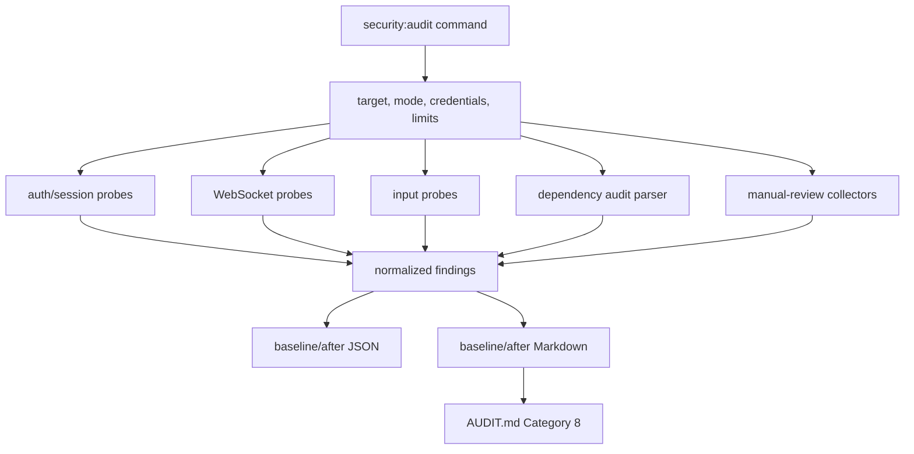

# Category 8 Security Audit Plan

## Summary

Build Category 8 as a first-class security audit deliverable for ShipShape: a runnable probe tool, baseline JSON and Markdown reports, an `AUDIT.md` Category 8 section with the exact PDF metrics, and at least two verified security remediations with before/after proof.

The probe must run against local, remote, and production targets. All required checks are default-on, including authentication/session, WebSocket validation, input sanitization, dependency CVEs, CORS/CSP, secrets exposure, rate limiting, and verbose error behavior. Production probing is allowed, but the implementation must keep request volume bounded, mark created records clearly, and clean up when authenticated cleanup is available.

## Problem Frame

The original ShipShape audit covered seven improvement categories. The new security PDF adds an eighth category with a different evidence standard: it requires active probing of a live application, not only code review or dependency scanning. Ship has multiple meaningful attack surfaces: session cookies, CSRF-protected REST APIs, public feedback, WebSocket collaboration, Yjs sync messages, user-generated TipTap content, file metadata flows, and a dependency tree that has already been hardened in earlier phases.

The plan therefore separates baseline measurement from remediation. First, the tool must gather reproducible evidence and populate the audit metric table. Then the team selects at least two verified findings, fixes them, and proves the fixes with probe output or regression tests. A baseline-only result is not complete.

## Requirements

Source: `docs/brainstorms/2026-05-21-phase-16-category-8-security-audit.md`.

### Actors

- A1. Grader: Runs the probe against a fresh local or remote Ship instance and reviews the structured report.
- A2. Auditor: Interprets probe and manual-review findings, updates audit documentation, and implements fixes.
- A3. Ship operator: Provides target URL and credentials when authenticated checks require them.
- A4. Ship application: The API, web frontend, collaboration server, database-backed content flows, and dependency tree under audit.

### Key Flows

- F1. Baseline security probe: run one command, try default credentials, fall back to explicit credentials or prompt, execute all possible checks, and emit JSON plus Markdown.
- F2. Manual security review: review CORS/CSP, secrets exposure, rate limiting, and verbose errors, then record yes/no findings with concrete details.
- F3. Before/after remediation proof: select at least two verified findings, capture reproduction evidence, apply fixes, rerun probe or tests, and document proof.

### Functional Requirements

- R1. Add a runnable script or CLI security probe executable with one documented command.
- R2. Support local and remote target modes, including production URLs.
- R3. Run required checks by default, including input and WebSocket probes, with bounded payloads and cleanup where practical.
- R4. Try `dev@ship.local / admin123` first in both local and remote modes, then explicit credentials or interactive prompt.
- R5. Mark authenticated checks as credentials-required when credentials are unavailable or invalid.
- R6. Test authentication and session behavior, including unauthenticated route access, malformed sessions, expiry indicators where observable, and role boundaries when multiple credentials are available.
- R7. Test WebSocket validation for malformed, oversized, and unexpected message types.
- R8. Test input sanitization across reachable user-facing fields using XSS strings, SQL injection-like strings, long inputs, stored vectors, and reflected vectors where applicable.
- R9. Run dependency audit programmatically, parse output, flag high/critical CVEs, and identify affected dependency paths or related features where determinable.
- R10. Emit JSON and Markdown reports with findings, severity, reproduction steps, target metadata, run timestamp, and not-run reasons.
- R11. Manually review CORS and CSP configuration and report misconfiguration as Yes/No with details.
- R12. Manually review environment variable and secret handling and report exposure risk as Yes/No with details.
- R13. Manually review rate limiting across API and WebSocket surfaces and list endpoints or channels where rate limiting appears absent.
- R14. Manually review error verbosity and report leakage as Yes/No with examples.
- R15. Add Category 8 to `AUDIT.md` with the exact baseline metric set from the PDF.
- R16. Include severity and reproduction detail for every listed vulnerability or failure.
- R17. Add Category 8 to `SUBMISSION.md` once baseline and remediation evidence exist.
- R18. Fix at least 2 verified security findings, preferring high or critical findings when found.
- R19. If no high or critical findings are found, fixing two verified lower-severity findings is acceptable.
- R20. Each fix must include vulnerability class, reproduction steps, fix summary, and before/after proof from probe output or a regression test.
- R21. Fixes must not break existing tests or relevant build/type-check gates.

### Acceptance Examples

- AE1. Given a locally running Ship instance, running the documented command completes and writes JSON plus Markdown reports.
- AE2. Given a remote target where default credentials fail and no explicit credentials are provided, authenticated probes are marked with credentials-required reasons rather than silently skipped.
- AE3. Given the collaboration WebSocket endpoint, malformed and unexpected messages are recorded as rejected, disconnected, accepted, or crash indicators.
- AE4. Given valid credentials, bounded XSS and long-input payloads submitted to editable fields are recorded as stored, reflected, sanitized, rejected, or errored.
- AE5. Given a completed baseline, `AUDIT.md` contains every PDF metric row in the required shape.
- AE6. Given two fixed findings, after evidence shows the findings no longer reproduce through probe output or regression tests.

## Scope Boundaries

- Full role-boundary and privilege-escalation checks require multiple credential sets. Without those, the report must mark those checks as credentials-required or secondary-credentials-required.
- Production probing is in scope, but destructive stress testing, high-volume fuzzing, broad port scanning, and third-party infrastructure scanning are out of scope.
- Active write probes are in scope by default because input failures are part of the deliverable. Created records must use a unique marker such as `ship-security-probe-<runId>` and be deleted where authenticated cleanup routes allow it.
- Dependency scanning is required but is not a substitute for the live Ship-specific probe.
- The paused full E2E release gate remained separate from this phase and was completed after Category 8 reached a stable point.

## Context & Research

- `docs/application-architecture.md` establishes the Express API, React/Vite web app, PostgreSQL persistence, deployment model, and testing strategy.
- `docs/unified-document-model.md` and `docs/document-model-conventions.md` confirm that audit-created issues/documents should use the existing document model and associations rather than adding new content tables.
- `docs/week-documentation-philosophy.md` confirms weekly planning/retro content is document-based and should not be special-cased unless a probe specifically targets accountability fields.
- `docs/claude-reference/security.md` documents the intended security model: 15-minute inactivity sessions, 12-hour absolute sessions, API tokens, CSRF, workspace authorization, document visibility, WebSocket rate limiting, and Zod validation.
- `api/src/app.ts` already wires Helmet, CSP, CORS, CSRF, login rate limiting, general API rate limiting, public feedback, protected REST routes, and error middleware.
- `api/src/middleware/auth.ts` validates bearer tokens before session cookies, enforces session expiry, refreshes session cookies, and verifies workspace membership.
- `api/src/collaboration/index.ts` already has WebSocket auth, document access checks, max payload limits, connection rate limiting, message rate limiting, and `/events` handling.
- `e2e/security.spec.ts` already covers browser-level XSS, file validation, path traversal, CSRF, auth, workspace isolation, and session behavior. The new probe should reuse this knowledge but must produce a grader-facing report artifact.
- `scripts/check-dependency-audit.mjs` already runs and parses `pnpm audit --json` for CI. The Category 8 tool can reuse the approach but must emit audit-specific CVE details and report rows.

## Key Technical Decisions

- Implement the probe in TypeScript under the API package so it can use existing dependencies, types, and Vitest without introducing a new runtime.
- Add root and API package scripts so the grader can run a short root command while implementation remains close to API/WebSocket dependencies.
- Keep report generation deterministic: every run writes JSON and Markdown, includes target metadata, and uses stable finding IDs.
- Keep probe checks table-driven so new endpoints or payloads can be added without scattering logic across the CLI.
- Treat manual-review items as report sections fed by both lightweight live probes and code review notes. The PDF asks for manual review, so these rows should not be hidden behind automated pass/fail only.
- Select remediation targets after the baseline run. The plan should not manufacture findings before measurement, but completion requires two verified fixes.

## Audit Deliverable Matrix

The final `AUDIT.md` Category 8 section and generated Markdown report must include this exact matrix shape. Baseline values are filled during execution, not during planning.

| Metric | Your Baseline | Source |
| --- | --- | --- |
| Security probe tool | Runnable (Yes / No) | Probe command and report metadata |
| Auth/session vulnerabilities found | List with severity | Auth/session probes plus manual review |
| WebSocket validation failures | List with severity | WebSocket probes |
| Input sanitization failures | List with severity | Input probes plus browser/security test evidence when relevant |
| High/Critical CVEs in dependencies | Count + list | Parsed dependency audit |
| CORS/CSP misconfiguration | Yes / No + details | Header probes plus manual review |
| Secrets exposure risk | Yes / No + details | Common-path/client-bundle checks plus manual review |
| Rate limiting absent on endpoints | List | Live bounded probes plus route/middleware review |
| Verbose error leakage | Yes / No + examples | Error probes plus error-handler review |

## Improvement Target Gate

Category 8 is not complete until at least 2 verified vulnerabilities or security findings are fixed.

Each fix must include:

- Vulnerability class.
- Reproduction steps used to confirm it.
- Fix applied.
- Evidence that the fix works, using tool output before vs. after or a regression test that would fail without the fix.
- Verification that existing relevant tests and build/type-check gates still pass.

If the baseline finds no high or critical vulnerabilities, choose the two highest-value lower-severity verified findings. Acceptable lower-severity findings can include misconfiguration, unsafe defaults, insufficient reporting of rejected inputs, missing regression coverage for a verified behavior, or bounded hardening opportunities discovered by the probe.

## Output Structure

Add or update:

- `api/src/security-probe/cli.ts`: CLI entry point and argument parsing.
- `api/src/security-probe/types.ts`: report, finding, severity, target, credential, and probe result types.
- `api/src/security-probe/config.ts`: mode defaults, env var parsing, prompt behavior, output paths, and safe limits.
- `api/src/security-probe/http-client.ts`: cookie jar, CSRF token handling, JSON request helper, header capture, and cleanup tracking.
- `api/src/security-probe/probes/auth.ts`: unauthenticated route, session, cookie, CSRF, and role-boundary probes.
- `api/src/security-probe/probes/websocket.ts`: `/events` and collaboration WebSocket probes.
- `api/src/security-probe/probes/input.ts`: XSS, SQLi-like, long-input, stored, reflected, and cleanup-oriented write probes.
- `api/src/security-probe/probes/dependencies.ts`: `pnpm audit --json` parser and optional dependency-path enrichment.
- `api/src/security-probe/probes/manual-review.ts`: CORS/CSP, secrets exposure, rate-limit, and verbose-error review collectors.
- `api/src/security-probe/reporter.ts`: JSON and Markdown report writers, audit matrix rendering, severity summaries.
- `api/src/security-probe/index.ts`: orchestration entry point usable by tests.
- `api/src/security-probe/*.test.ts`: focused unit tests for config, reporting, dependency parsing, severity classification, and probe result normalization.
- `api/package.json`: add an API-local `security:audit` script.
- `package.json`: add a root `security:audit` script that delegates to the API package.
- `eval/results/security-audit-baseline.json`: generated baseline JSON report.
- `eval/results/security-audit-baseline.md`: generated baseline Markdown report.
- `eval/results/security-audit-after.json`: generated after-fix JSON report.
- `eval/results/security-audit-after.md`: generated after-fix Markdown report.
- `AUDIT.md`: add Category 8 baseline and improvement evidence.
- `SUBMISSION.md`: add Category 8 reviewer-facing evidence links and commands.

Generated reports under `eval/results` should be committed only when they are the final baseline/after evidence for the project submission. Intermediate local probe output can be overwritten.

## High-Level Technical Design

The orchestrator returns a normalized report object. Each probe returns findings with:

- `id`
- `surface`
- `title`
- `severity`
- `status` such as `pass`, `finding`, `not_run_credentials_required`, `not_run_target_unavailable`, or `inconclusive`
- `reproduction`
- `evidence`
- `recommendation`
- `cleanup`

## Implementation Units

### U1. Probe CLI, Configuration, and Report Contract

**Purpose:** Establish the runnable tool, safe defaults, output contract, and report writers.

**Files:**

- Add `api/src/security-probe/cli.ts`.
- Add `api/src/security-probe/index.ts`.
- Add `api/src/security-probe/types.ts`.
- Add `api/src/security-probe/config.ts`.
- Add `api/src/security-probe/reporter.ts`.
- Update `api/package.json`.
- Update `package.json`.

**Behavior:**

- Root command: `pnpm security:audit -- --mode local`.
- Remote command: `pnpm security:audit -- --mode remote --web-url <url> --api-url <url>`.
- Defaults:
  - local web URL: `http://localhost:5173`
  - local API URL: `http://localhost:3000`
  - default email/password: `dev@ship.local` / `admin123`
  - output directory: `eval/results`
  - all checks enabled
- Support env vars for non-interactive runs:
  - `SHIP_SECURITY_WEB_URL`
  - `SHIP_SECURITY_API_URL`
  - `SHIP_SECURITY_EMAIL`
  - `SHIP_SECURITY_PASSWORD`
  - `SHIP_SECURITY_ALT_EMAIL`
  - `SHIP_SECURITY_ALT_PASSWORD`
  - `SHIP_SECURITY_NON_INTERACTIVE`
- Prompt for credentials only when stdin is interactive and default credentials fail.
- Generate both JSON and Markdown reports even when some checks cannot run.

**Tests:**

- Add `api/src/security-probe/config.test.ts`.
- Add `api/src/security-probe/reporter.test.ts`.
- Verify default local config, remote URL overrides, non-interactive credential behavior, report matrix rendering, and not-run status rendering.

**Traceability:** R1, R2, R3, R4, R5, R10, R15.

### U2. HTTP Client, Session, CSRF, and Cleanup Foundation

**Purpose:** Provide reliable HTTP probing primitives that match Ship's cookie and CSRF behavior.

**Files:**

- Add `api/src/security-probe/http-client.ts`.
- Update `api/src/security-probe/index.ts`.
- Add `api/src/security-probe/http-client.test.ts`.

**Behavior:**

- Maintain a cookie jar for session and CSRF flows.
- Fetch `/api/csrf-token` before state-changing authenticated requests.
- Log in through `/api/auth/login`.
- Capture `Set-Cookie` attributes for `session_id`.
- Track created document/comment/issue IDs with the run marker.
- Attempt cleanup through authenticated delete endpoints after write probes.
- Do not fail the whole run when cleanup fails; report cleanup evidence.

**Tests:**

- Unit-test cookie parsing, CSRF header injection, cleanup queue behavior, and response normalization with mocked fetch.

**Traceability:** R4, R5, R6, R8, R10.

### U3. Auth, Session, Route Exposure, and Role Boundary Probes

**Purpose:** Measure unauthenticated access and session behavior first, then authenticated and role-boundary behavior when possible.

**Files:**

- Add `api/src/security-probe/probes/auth.ts`.
- Add `api/src/security-probe/probes/auth.test.ts`.

**Probe set:**

- Unauthenticated protected route access for representative GET, POST, PATCH, and DELETE routes.
- Missing CSRF token on session-authenticated state-changing routes.
- Random/malformed `session_id` cookie.
- Login failure rate-limit signal with a small bounded number of invalid attempts.
- Session cookie flags:
  - `HttpOnly` required.
  - `SameSite=Strict` required.
  - `Secure` required for production HTTPS targets.
- Bearer token fallback behavior with malformed bearer token.
- Role-boundary probes when secondary credentials exist:
  - non-admin attempts to access admin endpoints.
  - workspace/document access checks between users where seed data permits.

**Tests:**

- Unit-test expected/failed status classification, cookie flag severity, and credentials-required status.

**Traceability:** R4, R5, R6, R13, R16.

### U4. WebSocket Validation Probes

**Purpose:** Actively test collaboration and event WebSocket validation without high-volume stress.

**Files:**

- Add `api/src/security-probe/probes/websocket.ts`.
- Add `api/src/security-probe/probes/websocket.test.ts`.

**Probe set:**

- Unauthenticated upgrade to `/events` should fail.
- Unauthenticated upgrade to `/collaboration/wiki:<uuid>` or a discovered document path should fail.
- Authenticated `/events` ping should receive pong.
- Authenticated `/events` malformed JSON should be ignored or rejected without crash.
- Authenticated collaboration path should reject malformed binary payloads safely.
- Unexpected Yjs message type should be rejected, ignored, or classified if accepted.
- Oversized payload check sends one bounded payload over the documented 10 MB limit only when target mode and configured limit allow it; record not-run if the configured maximum disables it.
- Small burst message-rate probe verifies rate-limit behavior without sustained flooding.

**Tests:**

- Unit-test close-code/evidence classification for 401, 403, 1008, 1009, unexpected close, accepted invalid data, and timeout.

**Traceability:** R3, R7, R13, R16.

### U5. Input Sanitization and Active Write Probes

**Purpose:** Exercise reachable user-facing fields with bounded XSS, SQLi-like, and long-input payloads.

**Files:**

- Add `api/src/security-probe/probes/input.ts`.
- Add `api/src/security-probe/probes/input.test.ts`.

**Probe set:**

- Public reflected/validation surfaces:
  - public feedback program lookup with malformed UUID.
  - login form/API invalid email and SQLi-like values.
- Authenticated stored surfaces when credentials work:
  - document title.
  - document content.
  - issue title.
  - comment content on a probe-created document.
  - file metadata upload request with dangerous filename and MIME type where possible without uploading dangerous content.
- Payload classes:
  - `<script>` and event-handler XSS markers.
  - `javascript:` and `data:text/html` URL markers where accepted by an endpoint.
  - SQLi-like strings such as `' OR '1'='1`.
  - long strings above known schema limits.
- Verify whether payload is rejected, sanitized, stored as inert text, reflected as executable markup, or causes an error.
- Cleanup created documents/comments/issues where possible.

**Tests:**

- Unit-test payload generation, response classification, stored/reflected finding severity, and cleanup report rows.

**Traceability:** R3, R8, R16, R18.

### U6. Dependency CVE Probe

**Purpose:** Make the dependency metric reproducible inside the Category 8 report.

**Files:**

- Add `api/src/security-probe/probes/dependencies.ts`.
- Add `api/src/security-probe/probes/dependencies.test.ts`.
- Optionally refactor shared audit parsing from `scripts/check-dependency-audit.mjs` only if it avoids duplication cleanly.

**Behavior:**

- Run `pnpm audit --json` from the repo root.
- Parse high and critical counts.
- List advisory/package, severity, vulnerable range, fix availability, and dependency path when available.
- For high/critical packages, optionally run `pnpm why <package>` with a timeout and include the workspace/package path.
- Do not fail report generation when `pnpm audit` exits non-zero because vulnerabilities are present.

**Tests:**

- Unit-test clean audit parsing, high/critical advisory parsing, non-JSON failure handling, and `pnpm why` timeout classification.

**Traceability:** R9, R15, R16.

### U7. Manual-Review Collectors and Documentation Notes

**Purpose:** Produce the PDF's manual review rows with evidence from headers, common exposure probes, and code review notes.

**Files:**

- Add `api/src/security-probe/probes/manual-review.ts`.
- Add `api/src/security-probe/probes/manual-review.test.ts`.
- Update `docs/claude-reference/security.md` only if implementation reveals outdated security docs.

**Probe and review set:**

- CORS:
  - Send preflight and simple requests with an untrusted `Origin`.
  - Flag wildcard credentials, reflected arbitrary origin, or missing expected CORS headers.
- CSP:
  - Capture CSP from web and API responses.
  - Flag missing CSP and dangerous directives such as unnecessary `unsafe-inline` where applicable.
- Secrets exposure:
  - Fetch common accidental exposure paths such as `/.env`, `/api/.env`, `/config.json`, and source maps where linked.
  - Inspect fetched HTML/JS for obvious non-public secret names while avoiding broad crawling.
  - Review client env usage so only intended `VITE_` values are exposed.
- Rate limiting:
  - Record middleware coverage from route mounting and WebSocket setup.
  - Use bounded live checks for login and WebSocket message-rate behavior.
  - List endpoints/channels where no protection is observable.
- Verbose errors:
  - Send malformed JSON, invalid UUIDs, invalid bodies, and unknown routes.
  - Flag stack traces, SQL fragments, filesystem paths, dependency internals, or secrets.

**Tests:**

- Unit-test CORS/CSP classification, secret-path classification, rate-limit evidence normalization, and verbose-error pattern detection.

**Traceability:** R11, R12, R13, R14, R15, R16.

### U8. Baseline Reports and Audit Documentation

**Purpose:** Convert probe output into project evidence.

**Files:**

- Generate `eval/results/security-audit-baseline.json`.
- Generate `eval/results/security-audit-baseline.md`.
- Update `AUDIT.md`.
- Update `SUBMISSION.md` after baseline plus after-fix evidence exists.

**Behavior:**

- Run baseline before fixes.
- Populate every audit deliverable matrix row.
- Include commands used, target metadata, timestamp, credentials mode, and not-run reasons.
- Do not hide inconclusive or credentials-required checks.

**Tests/verification:**

- Run `pnpm security:audit -- --mode local` against local dev.
- Run `pnpm security:audit -- --mode remote --web-url <url> --api-url <url>` against an approved remote target when available.
- Run `pnpm type-check`.
- Run `pnpm --filter @ship/api test`.

**Traceability:** R1, R2, R10, R15, R16, R17.

### U9. Remediation Selection and Two-Fix Proof

**Purpose:** Meet the improvement target after the baseline identifies verified findings.

**Files:**

- Modify finding-dependent files only after baseline confirms the targets.
- Likely areas, depending on findings:
  - `api/src/app.ts`
  - `api/src/middleware/errorHandler.ts`
  - `api/src/middleware/auth.ts`
  - `api/src/collaboration/index.ts`
  - `api/src/routes/*.ts`
  - `web/src/**/*`
  - `e2e/security.spec.ts`
  - `api/src/**/*.test.ts`
- Generate `eval/results/security-audit-after.json`.
- Generate `eval/results/security-audit-after.md`.
- Update `AUDIT.md`.
- Update `SUBMISSION.md`.

**Behavior:**

- Pick at least two verified findings from the baseline, preferring highest severity.
- For each fix, document vulnerability class, reproduction steps, fix applied, and proof.
- Add or update regression tests when the fix changes application behavior.
- Rerun the probe after fixes and link before/after report rows.

**Tests/verification:**

- Finding-specific regression tests.
- `pnpm type-check`.
- `pnpm build:shared`.
- `pnpm build:web`.
- `pnpm --filter @ship/api test`.
- Relevant E2E security tests or compact E2E runner subset if browser behavior changes.

**Traceability:** R18, R19, R20, R21.

## System-Wide Impact

- The probe adds a new operational tool but should not affect runtime API behavior until remediation fixes are selected.
- Active write probes will create temporary records on authenticated targets. These must be marked and cleaned up when possible.
- Remote/prod use requires careful output hygiene: reports should include evidence, not secrets or full session cookies.
- Dependency audit execution may take longer than normal unit tests but is acceptable because it is part of the deliverable.
- WebSocket probes can reveal brittle protocol handling. Findings should be classified by observed behavior rather than assuming every disconnect is a vulnerability.

## Risks & Mitigations

- Risk: Production write probes create visible records.
  - Mitigation: unique marker prefix, small payloads, cleanup queue, and report cleanup status.
- Risk: Default credentials fail on production.
  - Mitigation: prompt when interactive; otherwise mark authenticated checks as credentials-required.
- Risk: Oversized WebSocket payloads are too heavy for production.
  - Mitigation: one-message cap, configurable byte limit, and explicit not-run classification when disabled by configured safety limits.
- Risk: Manual-review rows become subjective.
  - Mitigation: use explicit yes/no fields, details, evidence snippets, and source rows.
- Risk: Remediation targets are unknown until baseline.
  - Mitigation: plan a remediation selection gate after baseline and require two highest-value verified findings.
- Risk: Existing E2E worktree edits overlap with security test files.
  - Mitigation: inspect local diffs before modifying `e2e/security.spec.ts` or shared fixtures; do not revert unrelated paused E2E work.

## Verification Plan

Planning does not run implementation checks. During execution, use this verification sequence:

1. `pnpm type-check`
2. `pnpm build:shared`
3. `pnpm --filter @ship/api test`
4. `pnpm security:audit -- --mode local`
5. `pnpm security:audit -- --mode remote --web-url <url> --api-url <url>` when a remote target is approved and reachable
6. Relevant browser/E2E security subset if web rendering or editor sanitization changes
7. Compact full E2E gate after Category 8 and the paused E2E stabilization work are ready to resume

## Documentation Plan

- Add the single-command probe usage to `AUDIT.md` Category 8 and `SUBMISSION.md`.
- Include the audit deliverable matrix exactly.
- Link or reference `eval/results/security-audit-baseline.md` and `eval/results/security-audit-after.md`.
- For each of the two fixes, document:
  - vulnerability class
  - reproduction command/steps
  - fix summary
  - before evidence
  - after evidence
  - regression test or probe proof

## Open Questions

- Which remote/prod web and API URLs should be used for the official submitted remote baseline?
- Should generated JSON reports redact exact cookies and bearer-token-like values even in local runs? Recommendation: yes, always redact.
- If the baseline finds more than two findings, should remediation prioritize severity, grader-visible value, or fastest safe fixes? Recommendation: severity first, then grader-visible value, then speed.

## Sources & References

- `docs/brainstorms/2026-05-21-phase-16-category-8-security-audit.md`
- `docs/application-architecture.md`
- `docs/unified-document-model.md`
- `docs/document-model-conventions.md`
- `docs/week-documentation-philosophy.md`
- `docs/claude-reference/security.md`
- `api/src/app.ts`
- `api/src/middleware/auth.ts`
- `api/src/middleware/errorHandler.ts`
- `api/src/collaboration/index.ts`
- `scripts/check-dependency-audit.mjs`
- `e2e/security.spec.ts`
