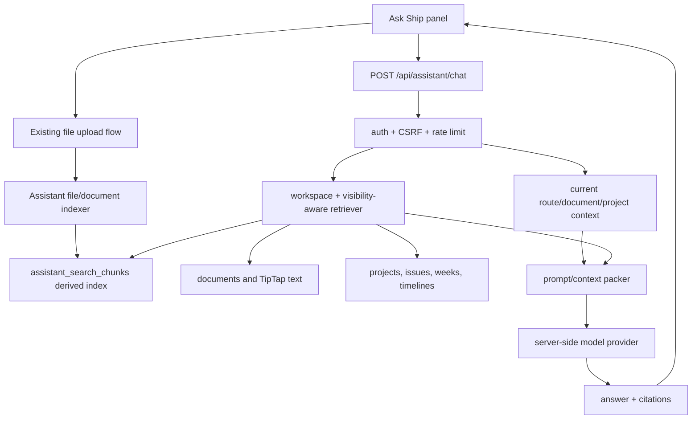

# Ask Ship AI Assistant Plan

## Summary

Build a native Ship AI assistant MVP inside the existing TypeScript/Express/React app. The assistant should answer questions about Ship projects, issues, weeks, timelines, and documentation, support documentation file uploads, and cite the Ship records or uploaded documentation it used.

The MVP deliberately stops short of full Week2 chatbot parity. It should not add a Python sidecar, LangGraph-style supervisor, hybrid vector retrieval, reranking, or persistent multi-session chat memory. Those are deferred follow-up capabilities. The first version should prove the high-value product loop: a user can open Ship, ask "what is blocked?", "what changed since baseline?", or "what does this uploaded project brief say?", and get an answer grounded in the current workspace with links back to source records.

## Problem Frame

Ship already contains the operational knowledge the chatbot needs: documents, projects, issues, weeks, dependencies, timelines, weekly plans, retros, and uploaded attachments. The missing piece is an assistant layer that can retrieve the right workspace-scoped context, package it safely for an LLM, and present a useful answer inside the app.

The Week2 chatbot provides a useful reference for interaction shape and attachment handling, but it is a Python/FastAPI clinical assistant with healthcare-specific pipelines. Ship's architecture is different: Express, PostgreSQL, React, TipTap/Yjs, session auth, CSRF, workspace visibility, and Render deployment. The plan therefore adapts the idea, not the implementation.

## Requirements

### Actors

- A1. Ship user: Asks questions about projects, issues, weeks, timelines, docs, and uploaded documentation in their workspace.
- A2. Document author: Uploads or attaches documentation that should become searchable by the assistant.
- A3. Workspace admin/operator: Configures model credentials and storage for the deployed assistant.
- A4. Ship application: Enforces authentication, workspace scoping, document visibility, upload safety, and rate limits.

### Functional Requirements

- R1. Add an authenticated in-app assistant surface named "Ask Ship".
- R2. Let users ask natural-language questions from anywhere in the authenticated app.
- R3. Include current route/document/project context when available.
- R4. Retrieve relevant workspace-visible documents, projects, issues, weeks, timelines, and uploaded documentation before calling the model.
- R5. Enforce the same workspace and document visibility rules used by existing document APIs.
- R6. Return citations that link back to Ship documents, projects, issues, timeline rows, or indexed file attachments.
- R7. Support documentation uploads for indexing, beginning with common text/document formats.
- R8. Store uploaded-document text as a derived search index, not as a parallel source of truth.
- R9. Use a server-side model provider only; no API keys or prompts are exposed to the client bundle.
- R10. Keep the first version non-streaming unless implementation discovers that streaming is nearly free within existing patterns.
- R11. Show clear unavailable, no-context, upload-indexing, and model-error states in the UI.
- R12. Add per-user or per-session assistant rate limiting to prevent cost amplification.
- R13. Limit prompt context size and file extraction size.
- R14. Avoid logging secrets, full prompts with private content, or model outputs containing sensitive workspace data.
- R15. Register new API routes in OpenAPI.
- R16. Document required environment variables and Render storage/model setup.
- R17. Add focused API, service, UI, and E2E coverage for the assistant MVP.
- R18. Place the Ask Ship entrypoint in the left icon rail, in the empty slot below the Team icon as shown by the red X in the user's placement screenshot.

### Acceptance Examples

- AE1. Given a logged-in user in a workspace with seeded project data, opening Ask Ship and asking "what projects are at risk?" returns a grounded answer with citations.
- AE2. Given a project timeline page, asking "what is blocking this project?" includes the current project context and cites timeline/dependency evidence.
- AE3. Given a private document created by another non-admin user, the assistant does not retrieve or cite that private document.
- AE4. Given an uploaded Markdown, text, PDF, or DOCX file attached to a wiki page, the assistant can answer questions from the extracted text after indexing completes.
- AE5. Given no model credentials configured, the assistant UI shows an unavailable state rather than failing silently.
- AE6. Given an oversized or unsupported file, upload may still behave according to the existing file route, but assistant indexing marks the file unsupported or too large without crashing.
- AE7. Given repeated assistant calls from one user, the assistant-specific rate limit eventually returns a controlled 429 response.

## Scope Boundaries

### In Scope For MVP

- A global in-app Ask Ship panel or drawer.
- Server-side chat endpoint with authenticated session and CSRF protection.
- Retrieval over existing documents, project records, issues, weeks, timeline rows, dependency edges, and indexed file text.
- Basic citations with source title, source type, link, and excerpt.
- File indexing for documentation-like uploads.
- Render-ready configuration documentation.
- Focused tests and one E2E smoke flow.

### Deferred To Follow-Up Work

- Full Week2 parity: LangGraph supervisor, model-chosen tool loop, hybrid BM25+dense retrieval, reranking, extraction traces, and eval harness.
- Persistent chat history across browser sessions.
- Streaming token responses.
- Multi-model routing or complex provider marketplace.
- User-editable assistant personas.
- Background worker queue for high-volume extraction.
- Cross-workspace search.
- Agentic write actions such as creating issues or editing docs from chat.

### Outside This MVP

- Building a separate Python agent service.
- Using uploaded files as executable content.
- Exposing raw prompts, session cookies, API keys, or provider errors to users.
- Bypassing Ship's document visibility model for better answer quality.

## Context & Research

- `docs/application-architecture.md` confirms the app should stay boring and native: Express, React, PostgreSQL, direct SQL, TanStack Query, and same-process WebSocket.
- `docs/unified-document-model.md` and `docs/document-model-conventions.md` require content-like entities to remain documents. Assistant search chunks are allowed as a derived index, not as a new content model.
- `docs/week-documentation-philosophy.md` confirms weekly plans and retros are document content and should be retrievable as part of normal document search.
- `api/src/routes/ai.ts` and `api/src/services/ai-analysis.ts` already establish a server-side AI pattern with provider isolation, content limits, and rate limiting.
- `api/src/routes/files.ts`, `web/src/services/upload.ts`, and `web/src/components/editor/FileAttachment.tsx` already implement the upload flow, but production Render currently needs a durable storage choice before file uploads can be relied on.
- `api/src/routes/documents.ts`, `api/src/routes/projects.ts`, and `api/src/services/timeline.ts` expose the document and project/timeline facts the assistant should retrieve.
- `api/src/middleware/auth.ts` and `api/src/middleware/visibility.ts` provide the workspace and visibility enforcement patterns the assistant must reuse.
- `api/src/openapi/schemas/*` and `api/src/openapi/schemas/index.ts` show that new API routes must be documented through Zod/OpenAPI registration.
- `web/src/pages/App.tsx` is the right app-shell integration point for a global assistant button/panel.
- `web/src/main.tsx` shows authenticated routes are already wrapped with workspace, auth, realtime, document, project, issue, and upload providers.
- The Week2 chatbot reference, inspected outside this repo, provides inspiration for route-level chat dispatch, attachment-aware orchestration, future retrieval depth, and chat UI attachment affordances. It is not a direct code source for this Ship-native plan.

## Key Technical Decisions

- Build the assistant as a native Ship feature in `api`, `web`, and `shared`, not as a separate Week2-style Python service.
- Place the assistant entrypoint in the existing left icon rail below Team. This keeps it globally reachable without adding another top-level page or disrupting the 4-panel document layout.
- Use a thin LLM provider boundary. The MVP should implement one provider path for Render, preferably OpenAI-compatible HTTP calls via server-side `fetch`, while keeping the boundary small enough to add Bedrock later.
- Use PostgreSQL full-text retrieval and deterministic structured context first. Do not add embeddings, vector storage, or reranking in the MVP.
- Store assistant search chunks as derived data. The source of truth remains `documents` and `files`; chunks can be regenerated.
- Keep the first chat response non-streaming. This keeps UI, tests, CSRF, error handling, and rate limiting simpler.
- Treat file indexing as asynchronous-from-the-user's perspective but not necessarily a separate worker. The MVP can index during upload confirmation or through an authenticated reindex endpoint, with a clear status.
- Require citations for answers that use retrieved context. If no context is found, the assistant should say so and avoid pretending.
- Make prompt-injection resistance a first-class requirement: uploaded docs and Ship docs are untrusted context, not instructions.

## High-Level Technical Design

## Output Structure

Add or update:

- `shared/src/types/assistant.ts`: shared assistant request, response, citation, source, status, and indexing types.
- `shared/src/index.ts`: export assistant types.
- `api/src/db/migrations/040_assistant_search_index.sql`: derived chunk/index storage and file association/status fields.
- `api/src/services/assistant/context.ts`: current-document/project context builder.
- `api/src/services/assistant/retriever.ts`: visibility-aware search over Ship data and indexed uploads.
- `api/src/services/assistant/indexer.ts`: text extraction, chunking, and reindexing.
- `api/src/services/assistant/llm.ts`: small server-side model provider boundary.
- `api/src/services/assistant/prompt.ts`: prompt construction, context limits, and citation contract.
- `api/src/services/assistant/types.ts`: API-local service types where shared types are not enough.
- `api/src/routes/assistant.ts`: authenticated assistant endpoints.
- `api/src/openapi/schemas/assistant.ts`: OpenAPI schemas and path registrations.
- `api/src/openapi/schemas/index.ts`: assistant schema export.
- `api/src/app.ts`: route mounting and assistant-specific rate limiter wiring.
- `api/src/routes/files.ts`: optional document association and indexing trigger/status updates for uploaded files.
- `web/src/services/assistant.ts`: frontend API service.
- `web/src/hooks/useAssistant.ts`: TanStack Query/mutation state for assistant calls and indexing status.
- `web/src/components/assistant/AskShipButton.tsx`: icon button with tooltip and accessibility labels.
- `web/src/components/assistant/AskShipPanel.tsx`: panel/drawer shell.
- `web/src/components/assistant/AssistantComposer.tsx`: message input and send control.
- `web/src/components/assistant/AssistantMessages.tsx`: chat transcript rendering.
- `web/src/components/assistant/AssistantCitations.tsx`: source links and excerpts.
- `web/src/components/assistant/AssistantUpload.tsx`: optional upload-to-current-document affordance.
- `web/src/pages/App.tsx`: app-shell integration for the global assistant button/panel.
- `web/src/index.css`: assistant layout styles only where existing utility classes are insufficient.
- `render.yaml`: optional assistant env var declarations, if safe to include without secrets.
- `DEPLOYMENT.md`: model and storage configuration.
- `README.md` or `SUBMISSION.md`: brief usage notes if this becomes part of the demo story.

## Implementation Units

### U1. Assistant Contracts, OpenAPI, and Route Skeleton

**Purpose:** Establish the public shape of the MVP before wiring retrieval or model calls.

**Files:**

- Add `shared/src/types/assistant.ts`.
- Update `shared/src/index.ts`.
- Add `api/src/routes/assistant.ts`.
- Add `api/src/openapi/schemas/assistant.ts`.
- Update `api/src/openapi/schemas/index.ts`.
- Update `api/src/app.ts`.
- Add `api/src/routes/assistant.test.ts`.

**Behavior:**

- Add `GET /api/assistant/status` for feature availability, configured provider, and supported upload/indexing status.
- Add `POST /api/assistant/chat` with `message`, optional prior client-side messages, optional current document/project context, and optional source filters.
- Require `authMiddleware` and normal CSRF protection.
- Return a typed response with assistant message, citations, source counts, and a controlled error code when unavailable.
- Mount all assistant endpoints under `/api/assistant`.

**Test Scenarios:**

- Unauthenticated `GET /api/assistant/status` is rejected.
- Authenticated status returns unavailable when no provider key is configured.
- `POST /api/assistant/chat` rejects empty messages and over-long messages.
- `POST /api/assistant/chat` enforces CSRF for session-authenticated requests.
- OpenAPI JSON includes the assistant paths and schemas.

### U2. Derived Search Index and Visibility-Aware Retrieval

**Purpose:** Create the assistant's grounding layer without duplicating Ship's source-of-truth model.

**Files:**

- Add `api/src/db/migrations/040_assistant_search_index.sql`.
- Add `api/src/services/assistant/retriever.ts`.
- Add `api/src/services/assistant/context.ts`.
- Add `api/src/services/assistant/retriever.test.ts`.
- Add `api/src/services/assistant/context.test.ts`.

**Behavior:**

- Create a derived `assistant_search_chunks` table keyed by workspace, source type, source ID, document ID, chunk index, source title, excerpt text, metadata, and full-text search vector.
- Keep source documents and files authoritative; chunks are disposable and regenerable.
- Retrieve only rows in the user's workspace.
- Apply document visibility checks equivalent to `VISIBILITY_FILTER_SQL`.
- Search over document title/content, project/issue/week fields, timeline summaries, and indexed file chunks.
- Build source URLs such as `/documents/:id` where possible.
- Include current document/project context from the route as a retrieval boost, not as a visibility bypass.

**Test Scenarios:**

- Workspace A user cannot retrieve Workspace B chunks.
- Non-admin user cannot retrieve another user's private document chunks.
- Admin can retrieve workspace private-document chunks according to existing admin visibility behavior.
- Current project context boosts project-related chunks above unrelated chunks.
- Empty result returns a no-context response shape rather than throwing.
- Deleted or archived documents are excluded unless an explicit future option includes them.

### U3. Documentation Upload Association, Extraction, and Indexing

**Purpose:** Let uploaded documentation become assistant-searchable while preserving existing file-upload behavior.

**Files:**

- Update `api/src/routes/files.ts`.
- Add `api/src/services/assistant/indexer.ts`.
- Add `api/src/services/assistant/extractors.ts`.
- Add `api/src/services/assistant/indexer.test.ts`.
- Update `web/src/services/upload.ts`.
- Update `web/src/components/editor/FileAttachment.tsx`.
- Add or update `web/src/components/editor/FileAttachment.test.ts`.

**Behavior:**

- Add optional `documentId` support to upload metadata so files can be associated with the current wiki/project/document page.
- Add extraction/indexing status for files: `not_indexed`, `indexing`, `indexed`, `unsupported`, `failed`, or equivalent.
- Support text extraction for common documentation formats in the MVP:
  - `.txt`
  - `.md`
  - `.csv`
  - `.pdf`
  - `.docx`
- Mark other files as uploaded but unsupported for assistant indexing.
- Enforce extraction size limits independent of upload size limits.
- Chunk extracted text into citation-friendly passages.
- Trigger indexing after local upload completion and after production upload confirmation.
- Add a reindex path for a document or file when extraction fails or content changes.
- Add a storage driver decision for Render:
  - Prefer object storage for production durability.
  - Support a configured local upload directory only when backed by persistent storage.

**Test Scenarios:**

- Upload request accepts a valid `documentId` in the same workspace.
- Upload request rejects or ignores a `documentId` the user cannot access.
- TXT/MD/CSV extraction indexes expected text.
- PDF/DOCX extraction handles a small fixture and creates chunks.
- Unsupported file type records `unsupported` without failing upload.
- Oversized extraction records a controlled `failed` or `unsupported` status.
- Reindex replaces old chunks instead of duplicating them.

### U4. Model Provider, Prompt Contract, and Citation Enforcement

**Purpose:** Call the LLM safely with bounded, grounded context.

**Files:**

- Add `api/src/services/assistant/llm.ts`.
- Add `api/src/services/assistant/prompt.ts`.
- Add `api/src/services/assistant/prompt.test.ts`.
- Add `api/src/services/assistant/llm.test.ts`.
- Update `api/package.json` only if a small provider SDK or extraction dependency is chosen.

**Behavior:**

- Read provider configuration from server-side environment variables:
  - `SHIP_ASSISTANT_ENABLED`
  - `SHIP_ASSISTANT_PROVIDER`
  - `SHIP_ASSISTANT_MODEL`
  - `OPENAI_API_KEY` for the Render-friendly provider path
  - optional Bedrock variables for later provider reuse
- Keep provider errors server-side and map them to safe API responses.
- Build prompts that separate:
  - system instructions
  - user question
  - current Ship context
  - retrieved untrusted source excerpts
- Instruct the model that retrieved documents are evidence, not instructions.
- Require the answer to reference citation IDs from provided sources.
- Enforce max message length, max context chunks, and max total context characters.
- Return "I could not find enough Ship context" when retrieval has no relevant sources.

**Test Scenarios:**

- Prompt builder never includes client-provided system messages.
- Prompt builder labels retrieved text as untrusted context.
- Context truncation preserves citation IDs and source titles.
- Provider unavailable maps to a controlled unavailable response.
- Provider response without valid citation references is handled with a fallback or repair path.

### U5. Assistant Chat Orchestration, Rate Limits, and Observability

**Purpose:** Combine retrieval, prompt construction, model call, and response normalization behind the API route.

**Files:**

- Add `api/src/services/assistant/chat.ts`.
- Update `api/src/routes/assistant.ts`.
- Update `api/src/app.ts`.
- Add `api/src/services/assistant/chat.test.ts`.
- Extend `api/src/routes/assistant.test.ts`.

**Behavior:**

- Add an assistant-specific rate limiter lower than the general API limit.
- Use authenticated user ID and workspace ID from `authMiddleware`.
- Retrieve context, call the provider, normalize citations, and return a stable response shape.
- Log operational metadata only:
  - user ID
  - workspace ID
  - source counts
  - duration
  - provider name/model
  - success/error code
- Do not log full prompts, extracted document text, file contents, API keys, or full model responses.
- Return clear error states for unavailable provider, rate-limited request, retrieval failure, and model failure.

**Test Scenarios:**

- Chat service returns cited answer when retriever and provider succeed.
- Chat service returns no-context response without provider call when retrieval has no sources.
- Rate limit blocks repeated calls from the same user.
- Logs do not include prompt text or API keys in tested log payloads.
- A provider exception does not leak stack traces or upstream response bodies to the client.

### U6. App Shell UI: Ask Ship Panel

**Purpose:** Give users an ergonomic assistant inside the existing Ship app without disrupting the 4-panel editor model.

**Files:**

- Add `web/src/services/assistant.ts`.
- Add `web/src/hooks/useAssistant.ts`.
- Add `web/src/components/assistant/AskShipButton.tsx`.
- Add `web/src/components/assistant/AskShipPanel.tsx`.
- Add `web/src/components/assistant/AssistantComposer.tsx`.
- Add `web/src/components/assistant/AssistantMessages.tsx`.
- Add `web/src/components/assistant/AssistantCitations.tsx`.
- Add `web/src/components/assistant/AssistantUpload.tsx`.
- Update `web/src/pages/App.tsx`.
- Add `web/src/components/assistant/*.test.tsx`.

**Behavior:**

- Add an icon-only Ask Ship button with `aria-label` and tooltip, following `docs/document-model-conventions.md`.
- Position the Ask Ship button in the left icon rail below the Team icon, matching the red-X placement requested by the user.
- Open a drawer or panel that does not replace the document properties sidebar.
- Include current route/document/project context in chat requests.
- Show assistant availability from `GET /api/assistant/status`.
- Render user and assistant messages with loading, error, empty, unavailable, and rate-limited states.
- Render citations as links back into Ship.
- Offer upload-to-current-document only when a current document context exists and upload indexing is available.
- Keep chat transcript session-local in the MVP.

**Test Scenarios:**

- Button has tooltip and accessible label.
- Panel opens and closes with keyboard and pointer interactions.
- Sending a message calls `/api/assistant/chat` with current document context.
- Unavailable provider status disables sending and explains the state.
- Citations render with source title, source type, and link.
- Upload control is hidden or disabled when no current document exists.
- Error responses render controlled user-facing messages.

### U7. Structured Project, Issue, Week, and Timeline Context

**Purpose:** Make answers about "work in Ship" better than generic document search.

**Files:**

- Add `api/src/services/assistant/work-context.ts`.
- Update `api/src/services/assistant/context.ts`.
- Update `api/src/services/assistant/retriever.ts`.
- Add `api/src/services/assistant/work-context.test.ts`.

**Behavior:**

- Build structured source summaries for:
  - current project
  - project issues and issue states
  - project timeline rows and dependencies
  - week documents, plans, and retros
  - blocked, overdue, and at-risk timeline flags
- Prefer existing services such as `api/src/services/timeline.ts` where possible.
- Convert structured facts into citation-bearing chunks so the model can cite them.
- Keep work-context retrieval read-only.

**Test Scenarios:**

- Current project context includes issue counts and blocked/dependency details.
- Timeline context includes blocked, overdue, and at-risk flags from existing service output.
- Week context includes plan/retro text extracted from document content.
- Work-context sources are omitted when the user lacks access.
- The assistant can answer a mocked "what is blocked?" question using only structured context.

### U8. Render Configuration, Storage Readiness, and Documentation

**Purpose:** Make the MVP deployable and understandable on the current Render path.

**Files:**

- Update `render.yaml` if non-secret assistant env placeholders are useful.
- Update `DEPLOYMENT.md`.
- Update `README.md` or `SUBMISSION.md` if the feature is part of a demo.
- Add `docs/assistant.md` if the setup details are too long for existing docs.

**Behavior:**

- Document required model env vars.
- Document file storage choices for Render:
  - object storage path for durable production uploads, or
  - configured persistent disk path for demo/small deployment use.
- Document supported indexed file types and limits.
- Document how to verify assistant status after deploy.
- Document cost-control settings such as rate limits, model name, max context length, and upload extraction size.

**Test Expectation:** none for documentation-only changes, but rendered docs should be reviewed for accurate commands and env names.

### U9. End-to-End Verification and Demo Seed Coverage

**Purpose:** Prove the assistant works through the actual app, not only route tests.

**Files:**

- Add `e2e/assistant.spec.ts`.
- Update `e2e/fixtures/isolated-env.ts` if additional seeded docs/files/projects are required.
- Update `api/src/db/seed.ts` only if the demo needs richer assistant-ready data.

**Behavior:**

- Seed a small project/workspace context that supports a grounded question.
- Mock the model provider for E2E or expose a deterministic test provider in `E2E_TEST` mode.
- Verify opening Ask Ship, asking a project question, receiving an answer, and seeing a citation.
- Verify unavailable provider state without live credentials.
- Use the compact E2E runner: `pnpm test:e2e -- --workers=2`.

**Test Scenarios:**

- Assistant panel opens from app shell.
- Deterministic test provider returns a cited answer from seeded context.
- Citation link navigates to the expected document.
- Provider-unavailable state renders when assistant is disabled.
- A non-admin user does not see private seeded content they should not access.

## System-Wide Impact

- Adds a new AI-facing API surface and must preserve Ship's auth, CSRF, CORS, rate limiting, and error hygiene.
- Adds derived search/index storage. This increases database size but should remain bounded by extraction and chunk limits.
- Makes file upload storage a real deployment concern on Render. Current Render deployment does not configure AWS/S3 uploads, so upload-backed assistant indexing requires a storage decision.
- Adds model-provider operating cost. Rate limits and context caps are required from the first version.
- Adds UI to the global app shell. The panel must coexist with the 4-panel editor layout without stealing the document properties sidebar.

## Risks & Mitigations

- Risk: The assistant leaks private documents through retrieval.
  - Mitigation: route every retrieval query through workspace ID, document visibility, user ID, and admin role checks; add negative tests for private docs.
- Risk: Prompt injection in uploaded docs tells the model to ignore system instructions.
  - Mitigation: label all retrieved content as untrusted evidence and keep system/developer instructions separate from source excerpts.
- Risk: Render upload storage is not durable or not configured.
  - Mitigation: add explicit storage driver configuration and document the chosen deployment path before relying on uploaded-file demos.
- Risk: Full-text search is less powerful than embeddings.
  - Mitigation: scope this as MVP. Good structured context for projects/issues/timelines should carry the demo; hybrid RAG is deferred.
- Risk: Model calls become expensive.
  - Mitigation: per-user assistant limiter, max prompt size, max chunks, conservative model default, and status/config docs.
- Risk: File extraction libraries add dependency or build complexity.
  - Mitigation: keep supported formats narrow, add small fixtures, and mark unsupported formats cleanly.
- Risk: Chat UI grows into a separate app inside Ship.
  - Mitigation: keep MVP transcript session-local and defer persistent chat history, saved conversations, and agentic write actions.

## Verification Plan

Implementation should verify in this order:

1. `pnpm type-check`
2. `pnpm lint`
3. `pnpm build:shared`
4. `pnpm build:api`
5. `pnpm build:web`
6. API/service tests for assistant, indexer, retriever, and file association.
7. Component tests for assistant UI.
8. `pnpm test:e2e -- --workers=2` for the assistant smoke flow and any affected existing flows.
9. Render deploy verification:
   - `GET /api/assistant/status`
   - Ask a project question from the UI.
   - Upload/index one supported documentation file.
   - Confirm citations link to expected Ship records.

## Documentation Plan

- Add setup instructions for assistant model env vars.
- Document supported upload/index formats and limits.
- Document storage requirements for Render.
- Document a short "Ask Ship" demo flow:
  - open project/timeline
  - ask what is blocked
  - upload a project brief
  - ask a question answered from the uploaded file
  - click citation
- If included in final submission, update `demo-script-final.md` only after implementation exists.

## Open Questions

- Which model provider should be used first in production Render: OpenAI-compatible API, Bedrock with AWS credentials, or another provider? Recommendation for MVP: OpenAI-compatible path because it matches the Week2 reference and is simple to configure on Render.
- Which durable file storage path should be used for Render uploads? Recommendation: object storage for real durability; persistent disk is acceptable only for a small demo deployment.
- Should assistant chat history persist after the panel closes? Recommendation: no for MVP; keep it session-local and revisit after the grounded answer loop works.
- Should the first version expose uploads only in Docs, or from any current document? Recommendation: allow upload-to-current-document when a current document is available, with Docs/wiki as the primary demo path.

## Sources & References

- `docs/application-architecture.md`
- `docs/unified-document-model.md`
- `docs/document-model-conventions.md`
- `docs/week-documentation-philosophy.md`
- `api/src/routes/ai.ts`
- `api/src/services/ai-analysis.ts`
- `api/src/routes/files.ts`
- `api/src/routes/documents.ts`
- `api/src/routes/projects.ts`
- `api/src/services/timeline.ts`
- `api/src/middleware/auth.ts`
- `api/src/middleware/visibility.ts`
- `api/src/openapi/schemas/index.ts`
- `web/src/pages/App.tsx`
- `web/src/main.tsx`
- `web/src/services/upload.ts`
- `web/src/components/editor/FileAttachment.tsx`
- External Week2 chatbot reference inspected before planning: chat route, chat-turn orchestration, retrieval pipeline, and React chat UI.
